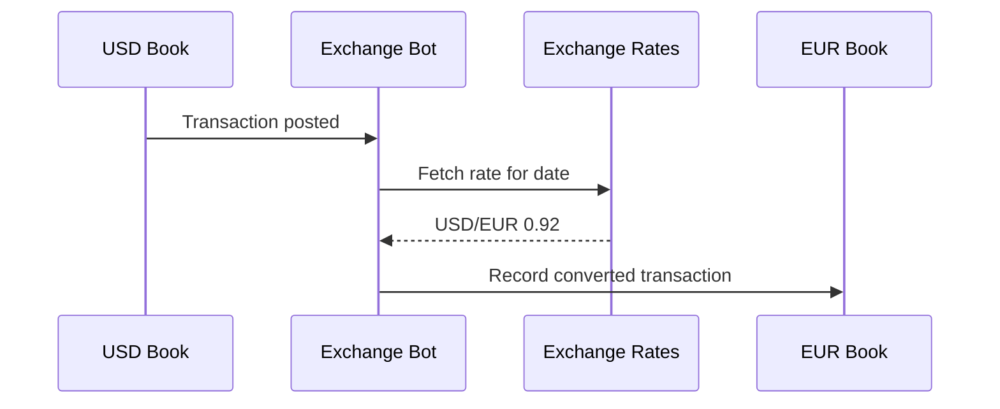
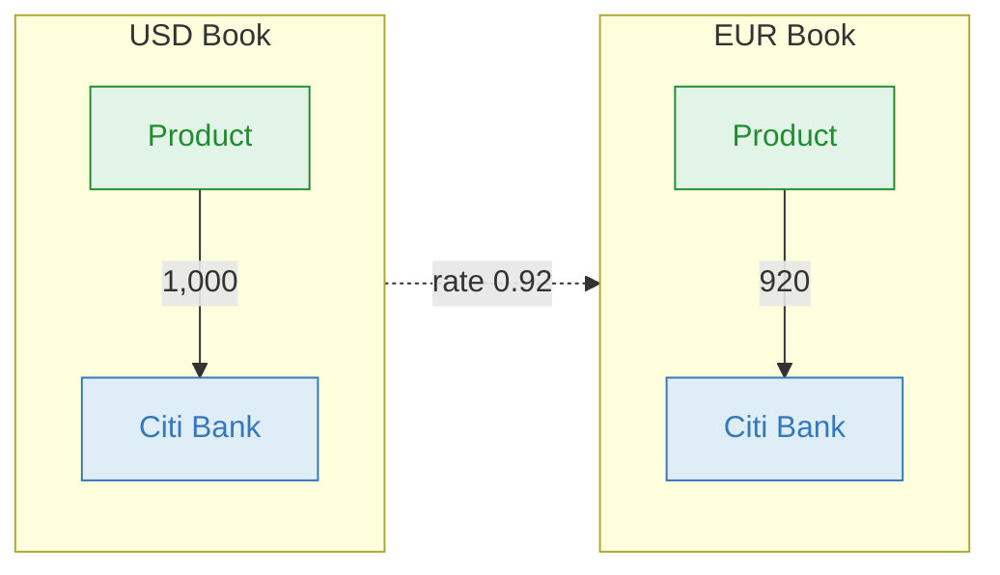
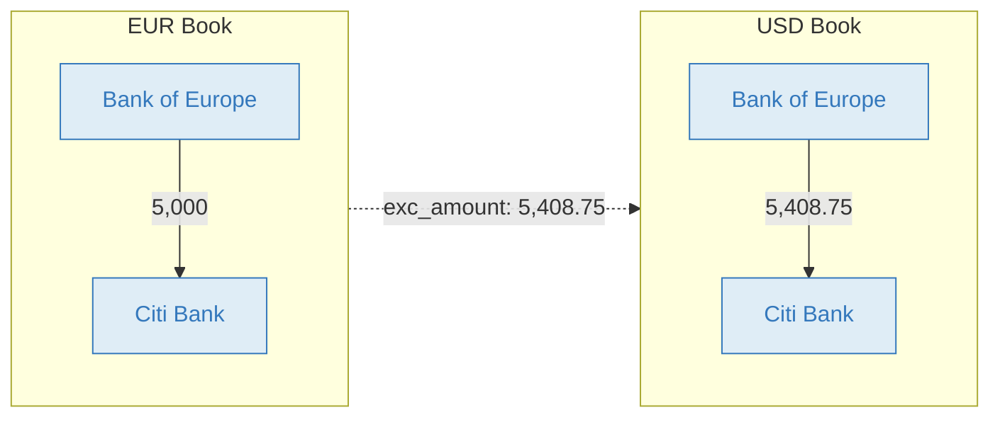

# Exchange Bot

The Exchange Bot automatically mirrors transactions across books in different currencies, converting amounts using exchange rates for the transaction date. It also calculates unrealized FX gains and losses, giving you a consolidated multi-currency view without manual replication.

Each currency lives in its own book within the same [collection](https://bkper.com/docs/core-concepts#collections), with `exc_code` set on each book. When you post a transaction in one book, the bot records the equivalent transaction in every other currency book.

## How it works

The Exchange Bot listens for transaction events across all books in a collection. When a transaction is posted, it fetches the exchange rate for that date and records a converted copy in every other currency book.

**You post in the USD book:**

```
15/03  1,000.00  Product  >>  Citi Bank  Invoice #1042
```

**The bot records in the EUR book** (at a rate of 0.92):

```
15/03    920.00  Product  >>  Citi Bank  Invoice #1042
```

The full amount is mirrored — only the currency changes.



## Mirroring a transaction

You sell a product for 1,000 USD. The customer pays into your US bank account. You have two books in a collection — one for USD and one for EUR.



| # | Amount | From | | To | Description | Book |
|---|---|---|---|---|---|---|
| You | **1,000** | Product `Incoming` | >> | Citi Bank `Asset` | Invoice #1042 | USD |
| Bot | **920** | Product `Incoming` | >> | Citi Bank `Asset` | Invoice #1042 | EUR |

**Result:** Product 1,000 in USD / 920 in EUR, Citi Bank +1,000 in USD / +920 in EUR

Book properties on each book:

```yaml
exc_code: USD
```

```yaml
exc_code: EUR
```

The chart of accounts is replicated across all books in the collection, using the same account and group names in each book.

<details>
<summary><strong>What stays in sync</strong></summary>

- checked, updated, deleted, and restored transactions stay synchronized across books
- account and group creates, updates, and deletions are propagated across books
- selected book settings and shared Exchange Bot properties are copied across connected books

</details>

## International wire transfer

When transferring between currencies, the actual rate often differs from the market rate due to spreads and fees. Use transaction properties to specify the exact converted amount.

**You post in the EUR book:**

```
20/03  5,000.00  Bank of Europe  >>  Citi Bank  Wire transfer
exc_amount: 5,408.75
exc_code: USD
```

**The bot records in the USD book** (using your specified amount instead of the market rate):

```
20/03  5,408.75  Bank of Europe  >>  Citi Bank  Wire transfer
```



| # | Amount | From | | To | Description | Book |
|---|---|---|---|---|---|---|
| You | **5,000** | Bank of Europe `Asset` | >> | Citi Bank `Asset` | Wire transfer | EUR |
| Bot | **5,408.75** | Bank of Europe `Asset` | >> | Citi Bank `Asset` | Wire transfer | USD |

**Result:** Bank of Europe −5,000 EUR / −5,408.75 USD, Citi Bank +5,000 EUR / +5,408.75 USD

Transaction properties on the posted transaction:

```yaml
exc_amount: 5,408.75
exc_code: USD
```

## FX gains and losses

Over time, exchange rate fluctuations change the value of balances held in foreign currencies. The Exchange Bot calculates these unrealized gains and losses on demand.

Open any book in the collection and select **More > Exchange Bot**. Choose a date and click **Gain/Loss**. The bot adjusts each account's balance using the selected rates and records the difference in automatically created exchange accounts (suffixed with **EXC**).

In the Gain/Loss view, the bot loads exchange rates for the selected date and displays them as editable fields, so you can adjust them before running the update. If one or more books in the collection are marked with `exc_base`, a single run updates Gain/Loss across all base books. If no base books are configured, the run applies across all connected exchange books.

The action is available only when the user has the required permissions and there are no pending bot tasks or bot errors in the connected books.

**Example:** Your EUR book holds a Citi Bank balance of 920. The original rate was 0.92 but the current rate is 0.94 — a gain of 20.


| # | Amount | From | | To | Description |
|---|---|---|---|---|---|
| Bot | **20** | Citi Bank EXC `Liability` | >> | Citi Bank `Asset` | `#exchange_gain` |

**Result:** Citi Bank 940, Citi Bank EXC −20

## Configuration

<details>
<summary><strong>Book properties</strong></summary>

Set these on each book in the collection.

| Property | Required | Description |
|---|---|---|
| `exc_code` | Yes | The book's currency code (e.g. `USD`, `EUR`, `JPY`) |
| `exc_rates_url` | No | Custom exchange rates endpoint URL. Default: [Open Exchange Rates](https://openexchangerates.org/) |
| `exc_on_check` | No | Set to `true` to delay normal mirroring of an unchecked transaction until it is checked. Later transaction events, such as updates, may still synchronize related changes. Default: `false` |
| `exc_base` | No | Marks this book as a base book. When at least one base book exists in the collection, transactions are always mirrored to base books, while other books only receive transactions whose accounts match that book's currency via group name or group `exc_code` |
| `exc_historical` | No | Set to `true` to consider balances since the beginning of the book. Default: uses balances after the [closing date](https://bkper.com/docs/guides/using-bkper/books) |
| `exc_aggregate` | No | Set to `true` to use a single `Exchange_XXX` account per currency instead of per-account EXC accounts |

**Example:**

```yaml
exc_code: USD
```

</details>

<details>
<summary><strong>Group properties</strong></summary>

Group properties control which accounts participate in multi-currency mirroring. The bot matches accounts by **group name** against `exc_code` from associated books, or by the `exc_code` property set on the group.

| Property | Description |
|---|---|
| `exc_code` | The currency code of the accounts in this group |
| `exc_account` | Optional — name of the exchange account to use for gain/loss |

</details>

<details>
<summary><strong>Account properties</strong></summary>

| Property | Description |
|---|---|
| `exc_account` | Optional — name of the exchange account to use for gain/loss |

By default, an account with suffix `EXC` is created for each account (e.g. *Citi Bank EXC*). Set `exc_account` on an account or its group to override the default.

**Example:**

```yaml
exc_account: Assets_Exchange
```

> The first `exc_account` found is used. Avoid setting it on multiple groups for the same account.

</details>

<details>
<summary><strong>Transaction properties</strong></summary>

Transaction properties can override how the bot determines the converted amount for a specific transaction.

| Property | Description |
|---|---|
| `exc_code` | Identifies which target currency the `exc_amount` or `exc_rate` override applies to |
| `exc_amount` | The exact amount to use in the target currency instead of converting by market rate |
| `exc_rate` | The exact exchange rate to use instead of fetching one |
| `exc_date` | Overrides the date used to look up the exchange rate. It must match the book’s date format. It is used during mirroring and is not currently written to mirrored transactions. |

Use these properties when the actual conversion should differ from the default rate lookup — for example, in wire transfers, negotiated conversions, or settlements using a different effective date.

The bot also records these properties on mirrored transactions for traceability:

| Property | Description |
|---|---|
| `exc_code` | The reference currency used by the mirrored transaction |
| `exc_amount` | The original amount from the source transaction |
| `exc_rate` | The exchange rate used for conversion |

**Example — use a different date for the exchange rate lookup:**

```yaml
exc_date: 15/03/2026
```

**Example — wire transfer with a known converted amount:**

```yaml
exc_code: UYU
exc_amount: 1256.43
```

**Example — wire transfer with a known exchange rate:**

```yaml
exc_code: USD
exc_rate: 1.08175
```

</details>

<details>
<summary><strong>Custom exchange rates endpoint</strong></summary>

By default, the bot uses [Open Exchange Rates](https://openexchangerates.org/). You can use any provider — [Fixer](https://fixer.io/), a custom service, or your own endpoint.

Set the `exc_rates_url` book property:

```yaml
exc_rates_url: https://data.fixer.io/api/${date}?access_key=*****
```

**Supported expressions:**

| Expression | Description |
|---|---|
| `${date}` | Transaction date in ISO format `yyyy-mm-dd` |
| `${agent}` | Request source: `app` for menu-triggered, `bot` for transaction-triggered |

The endpoint must return JSON in this format:

```json
{
  "base": "EUR",
  "date": "2020-05-29",
  "rates": {
    "CAD": 1.565,
    "CHF": 1.1798,
    "GBP": 0.87295,
    "SEK": 10.2983,
    "USD": 1.2234
  }
}
```

</details>

<details>
<summary><strong>Status icons</strong></summary>

| Icon | Meaning |
|---|---|
| Blue | Working properly |
| Red | Error occurred |
| Absent | Not installed on this book |

</details>

## Learn more

- [Multiple currencies](https://bkper.com/docs/guides/accounting-principles/modeling/multiple-currencies) — conceptual guide on multi-currency accounting in Bkper
- [Structuring Books & Collections](https://bkper.com/docs/guides/accounting-principles/modeling/structuring-books-collections) — how bots connect books for consolidated reporting
