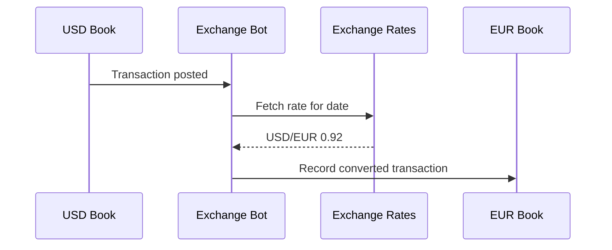
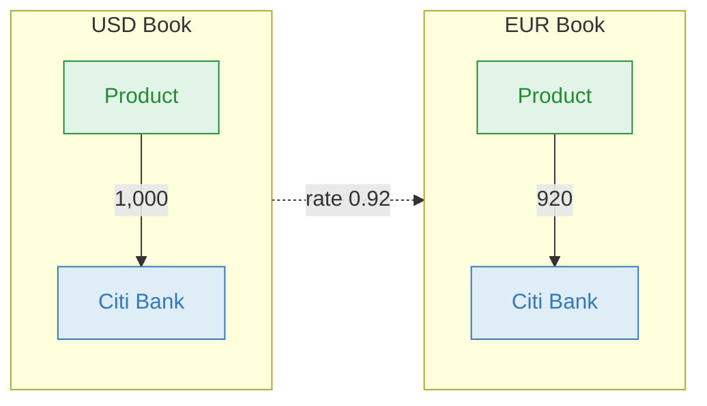
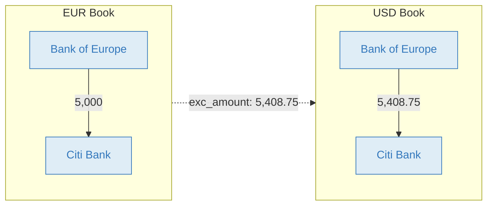

# Exchange Bot

The Exchange Bot automatically mirrors transactions across books in different currencies, converting amounts using exchange rates for the transaction date. It also calculates unrealized FX gains and losses, giving you a consolidated multi-currency view without manual replication.

Each currency lives in its own book. When you post a transaction in one book, the bot records the equivalent transaction in every other currency book in the same [collection](https://bkper.com/docs/core-concepts#collections).

## Setup requirements

Before using the bot:

- Put all participating currency books in the same collection
- Set `exc_code` on each participating book
- Install the Exchange Bot on each participating book
- Keep account names consistent across books — the bot mirrors accounts and groups by name and creates missing ones automatically

## How it works

The Exchange Bot listens for transaction events across all books in a collection. When a transaction is posted, it fetches the exchange rate for that date and records a converted copy in every other currency book.

It also keeps mirrored data aligned after the initial post:

- checked, updated, deleted, and restored transactions stay synchronized across books
- account and group creates, updates, and deletions are propagated across books
- selected book settings and shared Exchange Bot properties are copied across connected books



## Mirroring a transaction

You sell a product for 1,000 USD. The customer pays into your US bank account. You have two books in a collection — one for USD and one for EUR — with `exc_code` set on each.

**You post in the USD book:**

```
15/03  1,000.00  Product  >>  Citi Bank  Invoice #1042
```

**The bot records in the EUR book** (at a rate of 0.92):

```
15/03    920.00  Product  >>  Citi Bank  Invoice #1042
```



Both books stay in sync automatically. The chart of accounts is replicated across all books in the collection, using the same account and group names in each book.

## International wire transfer

When transferring between currencies, the actual rate often differs from the market rate due to spreads and fees. Use transaction properties to specify the exact converted amount.

**You post in the EUR book:**

```
20/03  5,000.00  Bank of Europe  >>  Citi Bank  Wire transfer
exc_amount: 5,408.75
exc_code: USD
```

**The bot records in the USD book** (using your specified amount instead of the market rate):

```
20/03  5,408.75  Bank of Europe  >>  Citi Bank  Wire transfer
```



## FX gains and losses

Over time, exchange rate fluctuations change the value of balances held in foreign currencies. The Exchange Bot calculates these unrealized gains and losses on demand.

Open any book in the collection and select **More > Exchange Bot**. Set the date and click **Gain/Loss**. The bot adjusts each account's balance to reflect current rates, recording the difference in automatically created exchange accounts (suffixed with **EXC**).

To run Gain/Loss successfully, the user must have access to the related books in the collection, and the collection must not have pending bot tasks or bot errors.

**Example:** Your EUR book holds a Citi Bank balance of 920. The original rate was 0.92 but the current rate is 0.94 — a gain of 20.


| # | Amount | From | | To | Description |
|---|---|---|---|---|---|
| Bot | **20** | Citi Bank EXC `Liability` | >> | Citi Bank `Asset` | `#exchange_gain` |

After the update, the Citi Bank balance in the EUR book reflects the current exchange rate, and the gain is tracked separately in the EXC account.

## Configuration

<details>
<summary><strong>Book properties</strong></summary>

Set these on each book in the collection.

| Property | Required | Description |
|---|---|---|
| `exc_code` | Yes | The book's currency code (e.g. `USD`, `EUR`, `JPY`) |
| `exc_rates_url` | No | Custom exchange rates endpoint URL. Default: [Open Exchange Rates](https://openexchangerates.org/) |
| `exc_on_check` | No | Set to `true` to mirror on CHECK events instead of POST. Default: `false` |
| `exc_base` | No | Marks this book as a base book. When at least one base book exists in the collection, transactions are always mirrored to base books, while other books only receive transactions whose accounts match that book's currency via group name or group `exc_code` |
| `exc_historical` | No | Set to `true` to consider balances since the beginning of the book. Default: uses balances after the [closing date](https://bkper.com/docs/guides/using-bkper/books) |
| `exc_aggregate` | No | Set to `true` to use a single `Exchange_XXX` account per currency instead of per-account EXC accounts |

**Example:**

```yaml
exc_code: USD
```

</details>

<details>
<summary><strong>Group properties</strong></summary>

Group properties control which accounts participate in multi-currency mirroring. The bot matches accounts by **group name** against `exc_code` from associated books, or by the `exc_code` property set on the group.

| Property | Description |
|---|---|
| `exc_code` | The currency code of the accounts in this group |
| `exc_account` | Optional — name of the exchange account to use for gain/loss |

</details>

<details>
<summary><strong>Account properties</strong></summary>

| Property | Description |
|---|---|
| `exc_account` | Optional — name of the exchange account to use for gain/loss |

By default, an account with suffix `EXC` is created for each account (e.g. *Citi Bank EXC*). Set `exc_account` on an account or its group to override the default.

**Example:**

```yaml
exc_account: Assets_Exchange
```

> The first `exc_account` found is used. Avoid setting it on multiple groups for the same account.

</details>

<details>
<summary><strong>Transaction properties</strong></summary>

Transaction properties override the fetched exchange rate for a specific transaction — useful for wire transfers where the actual rate differs from the market rate.

| Property | Description |
|---|---|
| `exc_code` | The currency code to override |
| `exc_amount` | The exact amount in the target currency |

The bot also records these properties on mirrored transactions for traceability:

| Property | Description |
|---|---|
| `exc_rate` | The exchange rate used for conversion |
| `exc_date` | The date used to fetch the rate |

**Example — wire transfer with a known amount:**

```yaml
exc_code: UYU
exc_amount: 1256.43
```

</details>

<details>
<summary><strong>Custom exchange rates endpoint</strong></summary>

By default, the bot uses [Open Exchange Rates](https://openexchangerates.org/). You can use any provider — [Fixer](https://fixer.io/), a custom service, or your own endpoint.

Set the `exc_rates_url` book property:

```yaml
exc_rates_url: https://data.fixer.io/api/${date}?access_key=*****
```

**Supported expressions:**

| Expression | Description |
|---|---|
| `${date}` | Transaction date in ISO format `yyyy-mm-dd` |
| `${agent}` | Request source: `app` for menu-triggered, `bot` for transaction-triggered |

The endpoint must return JSON in this format:

```json
{
  "base": "EUR",
  "date": "2020-05-29",
  "rates": {
    "CAD": 1.565,
    "CHF": 1.1798,
    "GBP": 0.87295,
    "SEK": 10.2983,
    "USD": 1.2234
  }
}
```

</details>

<details>
<summary><strong>Status icons</strong></summary>

| Icon | Meaning |
|---|---|
| Blue | Working properly |
| Red | Error occurred |
| Absent | Not installed on this book |

</details>

## Learn more

- [Multiple currencies](https://bkper.com/docs/guides/accounting-principles/modeling/multiple-currencies) — conceptual guide on multi-currency accounting in Bkper
- [Structuring Books & Collections](https://bkper.com/docs/guides/accounting-principles/modeling/structuring-books-collections) — how bots connect books for consolidated reporting
