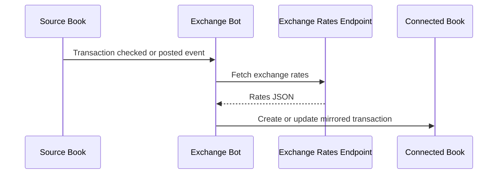

The Exchange Bot automatically convert transaction amounts between books using historical exchange rates, tracking gains and losses due to currency fluctuations, enabling multi-currency accounting and consolidated financial reporting.

It works by mirroring transactions from one book to other books, automatically applying updated conversion rates.


The Bkper Exchange Bot must be installed on all books in a Collection. For every transaction in a book within the Collection, it records another transaction on other Books with different currencies in the Collection. 

The Bkper Exchange Bot installation adds an item to the **More** menu. Open **More > Exchange Bot** to access gain/loss updates based on exchange rate variation.


The Bkper Exchange Bot default exchange rates are read at the moment of the gain/loss update from [Open Exchange Rates](https://openexchangerates.org/) Any other exchange rate source url can be used.


The chart of account (CoA) is synchronized on books in a Collection by the Bkper Exchange Bot.


## Configuration

The Exchange Bot works by listening for TRANSACTION_CHECKED events in your book, applying exchange rates from the an **exchange rates endpoint** and recording another transaction to the associated books:



The books are associated by its [Collection](https://help.bkper.com/en/articles/4208937-work-with-multiple-books), so a transaction in one book is mirrored on all books of the Collection.

### Book Properties

In order to proper setup the Exchange Bot on your books, some book properties should be set:

- ```exc_code```: Required - The book (currency) exchange code.
- ```exc_rates_url```: Optional - The rates endpoint url to use. Default: [Open Exchange Rates](https://openexchangerates.org/)
rate.
- ```exc_base```: Optional - true/false - Defines a book as a base and only mirror transactions to other books that matches the exchange base from accounts.
- ```exc_on_check```: Optional - true/false - True only to exchange on CHECK event. Default is false, performing exchange on POST events.
- ```exc_historical```: Optional - true/false - Defines if exchange updates should consider balances since the beginning of the book's operation. If set to false or not present, updates will consider balances after the book's [closing date](https://help.bkper.com/en/articles/5100445-book-closing-and-lock-dates).
- ```exc_aggregate```: Optional - true - If set to true, one exchange account named Exchange_XXX will be created for each XXX currency. If not present, each adjusted account will have an associated exchange account with suffix EXC.


You can associate multiple books.

Example:
```yaml
exc_code: USD
```


### Group Properties

As the rates changes over time, the balances on accounts with different currencies than the book should be adjusted and by gain/loss transactions. The transactions are triggered from the same **More > Exchange Bot** menu item:


The accounts will be selected by matching the **group names** with exc_code from associated books, or by the ```exc_code``` property set on Groups.

- ```exc_code```: The (currency) exchange code of the accounts of the group.
- ```exc_account```: Optional - The name of exchange account to use.


### Account Properties

- ```exc_account```: Optional - The name of the exchange account to use.

By default, an account with suffix ```EXC``` will be used for each account. You can change the default account by setting a ```exc_account``` custom property in the account **Account** or **Group**, with the name of the exchange account to use. Example:
```yaml
exc_account: Assets_Exchange
```
The first ```exc_account``` property found will be used, so, make sure to have only one group per account with the property set, to avoid unexpected behavior.


### Transaction Properties

To bypass dynamic rates from the endpoint and force use of fixed amount for a given exc_code, just use the following transaction properties:

- ```exc_code```: The exchange code to override.
- ```exc_amount```: The amount for that transaction, in the specified exchange code.

This is specially useful for remitences, when fees and spread will be processed later on gain/loss updates.

Some additional properties uses to track converted amounts:

- ```exc_code```: The exchange base code used to convert the transaction.
- ```exc_rate```: The exchange base rate used to convert the transaction.


Example:
```yaml
exc_code: UYU
exc_amount: 1256.43
```

That will generate a transaction in the current book of amount $1000, as well as another transaction on UYU book of $U35790.76.

### Exchange rates endpoint

By default, the [Open Exchange Rates](https://openexchangerates.org/) endpoint is used to fetch rates, but any endpoint can be provided, from other third party providers such as [Fixer](https://fixer.io/) or you can build your own. 

To change the default endpoint, set the ```exc_rates_url``` book property. 

Example:
```yaml
exc_rates_url: https://data.fixer.io/api/${date}?access_key=*****
```

**Supported expressions:**

- ```${date}```: The date of transaction in the standard ISO format ```yyyy-mm-dd```.
- ```${agent}```: The agent for the fetch request. 'app' for Gain/Loss update from menu. 'bot' for transaction post.


Despite of which endpoint choosed, the json format returned MUST be:

```typescript
{
  base: string;
  date: string; //yyyy-MM-dd
  rates: {
    [key: string]: number;
  }
}
```

Example:

```json
{
  "base": "EUR",
  "date": "2020-05-29",
  "rates": {
    "CAD": 1.565,
    "CHF": 1.1798,
    "GBP": 0.87295,
    "SEK": 10.2983,
    "EUR": 1.092,
    "USD": 1.2234,
  }
}
```

## Learn more

- [Multiple currencies](https://bkper.com/docs/guides/accounting-principles/modeling/multiple-currencies) — conceptual guide on multi-currency accounting in Bkper
- [Structuring Books & Collections](https://bkper.com/docs/guides/accounting-principles/modeling/structuring-books-collections) — how bots connect books for consolidated reporting
