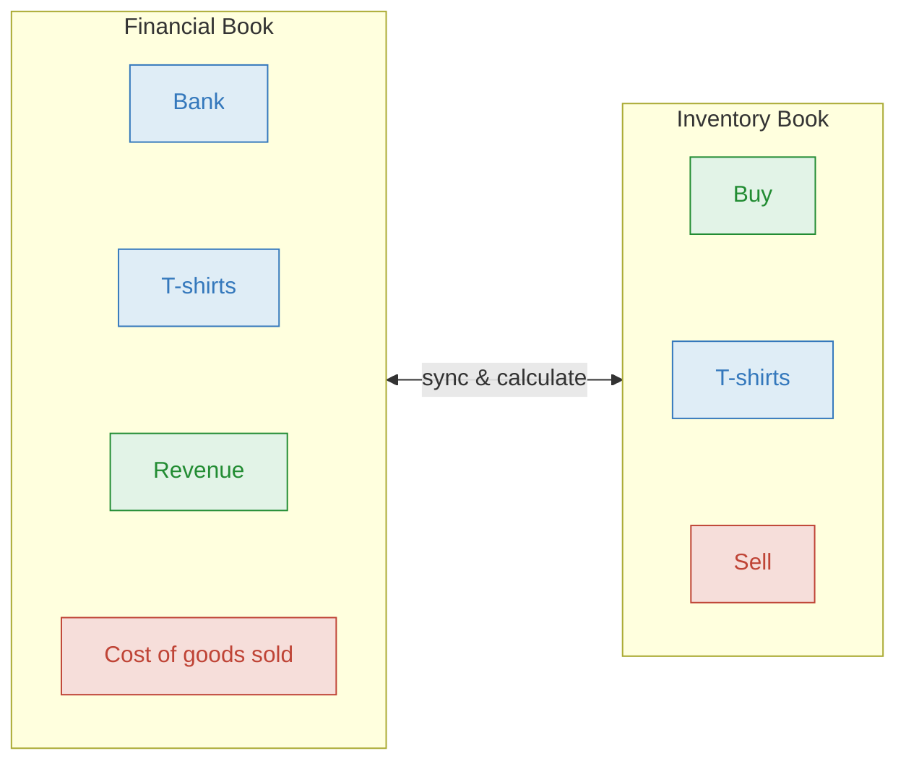
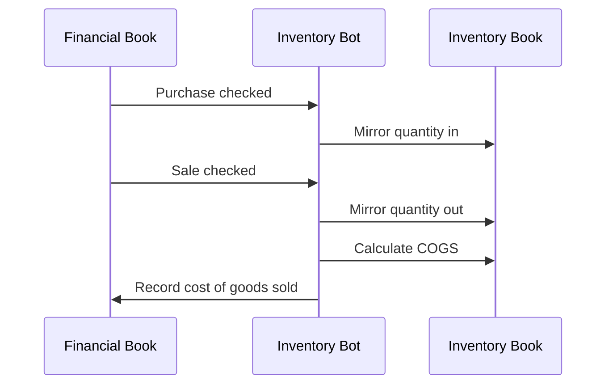

# Inventory Bot

The Inventory Bot tracks inventory quantities and calculates cost of goods sold (COGS) using FIFO. It bridges your Financial Book(s) (which track money) with a dedicated Inventory Book (which tracks quantities), so your profit calculations reflect what items actually cost.

## How it works

The bot operates across one shared Inventory Book and one or more Financial Books in the same [Collection](https://bkper.com/docs/guides/using-bkper/books):

- **Financial Book(s)** — record money flowing in and out (purchases, sales, revenue), typically one per currency
- **Inventory Book** — tracks quantities (units in, units out) managed entirely by the bot



When you **check** a purchase or sale transaction on the Financial Book, the bot mirrors it on the Inventory Book with quantities. When you **calculate cost of sales**, the bot matches sales to purchases using FIFO and records the cost on the Financial Book.



The bot links mirrored transactions across books using `remoteId`. That link is what allows the bot to find the corresponding transaction when it needs to delete, rebuild, or trace mirrored activity.

> The Inventory Book is managed entirely by the bot. Only make edits on the Financial Book.

## Purchase

You buy 100 T-shirts for $1,000. Record the purchase on the Financial Book and check it:

```
01/15  1000.00  Bank  >>  T-shirts  Purchase order  purchase_invoice: INV-001  purchase_code: INV-001  quantity: 100
```

The bot creates a matching entry on the Inventory Book — 100 units acquired at $10 per unit.

| # | Book | Amount | From | | To | Properties |
|---|---|---|---|---|---|---|
| You | Financial | **1,000.00** | Bank `Asset` | >> | T-shirts `Asset` | `purchase_invoice: INV-001` `purchase_code: INV-001` `quantity: 100` |
| Bot | Inventory | **100** | Buy `Incoming` | >> | T-shirts `Asset` | quantity mirrored |

Required properties: `purchase_invoice`, `purchase_code`, `quantity`

Optional: `order` (sequence when multiple purchases happen on the same day)

Notes:
- Decimal quantities are supported.
- If the `Buy` account is missing in the Inventory Book, the bot creates it automatically as an `Incoming` account.
- On purchase, the bot updates the Inventory Book item account using the Financial Book account's properties, archived status, and groups, creating missing direct groups when possible.

## Sale

You sell 30 T-shirts for $900. Record the sale on the Financial Book and check it:

```
02/01  900.00  Revenue  >>  Bank  Sale  sale_invoice: SALE-001  good: T-shirts  quantity: 30
```

The bot records 30 units out on the Inventory Book. The cost hasn't been calculated yet.

| # | Book | Amount | From | | To | Properties |
|---|---|---|---|---|---|---|
| You | Financial | **900.00** | Revenue `Incoming` | >> | Bank `Asset` | `sale_invoice: SALE-001` `good: T-shirts` `quantity: 30` |
| Bot | Inventory | **30** | T-shirts `Asset` | >> | Sell `Outgoing` | quantity mirrored |

Required properties: `sale_invoice`, `good` (must match the inventory account name exactly, case-sensitive), `quantity`

Optional: `order`

Notes:
- Decimal quantities are supported.
- If the `Sell` account is missing in the Inventory Book, the bot creates it automatically as an `Outgoing` account.
- ⚠️ If the `good` account does not already exist in the Inventory Book, the bot creates a bare `Asset` account automatically. Double-check spelling to avoid phantom inventory accounts caused by typos.

## Calculating cost of sales

Open the Inventory Bot menu (**More** > **Inventory Bot**) and click **Calculate**. The bot matches sales to purchases using FIFO (First-In, First-Out) — the oldest stock is consumed first. Calculation can run from the current context: a selected account, a selected group, or the whole Inventory Book.

The calculation processes only **unchecked** Inventory Book transactions. As FIFO runs, the bot automatically checks the purchase and sale lines it consumes, so manually checked Inventory Book transactions are skipped by later FIFO runs until you **Reset**.

All generated COGS entries are posted to an outgoing Financial Book account named **Cost of goods sold**. If that account does not exist, the bot creates it automatically.

During partial liquidations, the bot may split a purchase into smaller child transactions. Those child lines carry `parent_id` pointing back to the original purchase. This is normal and is how the bot preserves FIFO traceability.

From the example above, the 30 units sold came from the purchase at $10 each:

| # | Book | Amount | From | | To | Description |
|---|---|---|---|---|---|---|
| Bot | Financial | **300.00** | T-shirts `Asset` | >> | Cost of goods sold `Outgoing` | #COGS Sale |

**Result:** Revenue $900 − COGS $300 = Profit $600. Remaining inventory: 70 units at $10.

### FIFO across multiple purchases

When purchases happen at different prices, FIFO takes from the oldest first:

```
Purchase 1 → 100 units @ $10
Purchase 2 →  50 units @ $12
Purchase 3 →  20 units @ $15
```

Sell 120 units:
- 100 from Purchase 1 @ $10 = $1,000
- 20 from Purchase 2 @ $12 = $240
- **Total COGS = $1,240**

The bot maintains a purchase log and liquidation log on each transaction — a complete audit trail showing which purchases were matched to which sales.

## Configuration

<details>
<summary><strong>Book properties</strong></summary>

**Financial Book(s):**

| Property | Description |
|---|---|
| `exc_code` | **Required.** The exchange code representing the book's currency (e.g. `USD`, `EUR`). Also accepts legacy key `exchange_code` |

**Inventory Book:**

| Property | Description |
|---|---|
| `inventory_book` | **Required.** Set explicitly to `true`. Identifies this book as the Inventory Book for the collection. Only one per collection |

All participating books must be in the same [Collection](https://bkper.com/docs/guides/using-bkper/books). The bot must be installed on each relevant Financial Book and on the Inventory Book.

</details>

<details>
<summary><strong>Group properties</strong></summary>

Every inventory item account must belong to a group with:

| Property | Description |
|---|---|
| `exc_code` | **Required.** The exchange code that matches the Financial Book's currency. The bot uses this to link inventory items to the correct financial data |

```yaml
# Group: Products
exc_code: USD
```

Notes:
- Inventory item accounts should be `Asset` accounts. Book-wide and group-wide **Calculate** and **Reset** operations target `Asset` accounts.
- If the resolved good/account `exc_code` does not match the current Financial Book `exc_code`, event mirroring is skipped. During calculation, this may surface as `Cannot proceed: financial book not found for good account ...`.

</details>

<details>
<summary><strong>Transaction properties — purchase</strong></summary>

| Property | Required | Description |
|---|---|---|
| `purchase_invoice` | Yes | Reference to the purchase invoice number |
| `purchase_code` | Yes | Code that identifies this purchase. Must equal `purchase_invoice` for the main purchase. Additional costs and credit notes reference this code to link back |
| `quantity` | Yes | Number of units purchased. Decimal quantities are supported |
| `order` | No | Sequence number when multiple purchases happen on the same day |

</details>

<details>
<summary><strong>Transaction properties — sale</strong></summary>

| Property | Required | Description |
|---|---|---|
| `good` | Yes | Account name of the inventory item being sold. Must match exactly (case-sensitive) |
| `quantity` | Yes | Number of units sold. Decimal quantities are supported |
| `sale_invoice` | Yes | Reference to the sale invoice number |
| `order` | No | Sequence number when multiple sales happen on the same day |

</details>

<details>
<summary><strong>Transaction properties — additional costs</strong></summary>

Records extra costs added to a purchase (shipping, import duties). The bot adds this to the original purchase cost, raising the per-unit cost for COGS calculations.

| Property | Required | Description |
|---|---|---|
| `purchase_code` | Yes | Must match the original purchase's `purchase_code` to link them |
| `purchase_invoice` | Yes | Reference to the cost invoice number. Must differ from `purchase_code` — this is how the bot distinguishes additional costs from the main purchase |

Rules:
- Additional costs must be recorded within **2 months** of the original purchase date to be picked up during COGS calculation.
- Do **not** set `quantity` on an additional-cost transaction. The bot can interpret it as a purchase mirror and create unintended inventory units.
- Additional costs do **not** create quantity movements in the Inventory Book. They are applied later during COGS calculation through `purchase_code`.

</details>

<details>
<summary><strong>Transaction properties — credit note</strong></summary>

Records a refund or discount on a purchase. The bot deducts this from the original purchase cost.

| Property | Required | Description |
|---|---|---|
| `purchase_code` | Yes | Must match the original purchase's `purchase_code` to link them |
| `credit_note` | Yes | Invoice number of the credit note |
| `quantity` | No | Number of units returned. Include it only when goods are actually returned. Decimal quantities are supported |

Rules:
- Credit notes must be recorded within **2 months** of the original purchase date to be picked up during COGS calculation.
- If `quantity` is missing or `0`, the credit note is **not mirrored** to the Inventory Book. It affects COGS only during calculation through the `purchase_code` match in the Financial Book.
- If `quantity` is provided and greater than zero, the bot also mirrors the quantity reduction into the Inventory Book.

</details>

## Advanced

<details>
<summary><strong>Additional costs example</strong></summary>

You paid $200 shipping on a $1,000 purchase of 100 T-shirts:

| # | Book | Amount | From | | To | Properties |
|---|---|---|---|---|---|---|
| You | Financial | **1,000.00** | Bank `Asset` | >> | T-shirts `Asset` | `purchase_invoice: INV-001` `purchase_code: INV-001` `quantity: 100` |
| You | Financial | **200.00** | Bank `Asset` | >> | T-shirts `Asset` | `purchase_invoice: SHIP-001` `purchase_code: INV-001` |

No quantity movement is created on the Inventory Book for the shipping line. When calculating COGS, the bot includes the additional cost — per-unit cost becomes ($1,000 + $200) ÷ 100 = $12 instead of $10.

> Record the additional cost within 2 months of the original purchase date, or it will not be picked up by the FIFO cost lookup.

</details>

<details>
<summary><strong>Credit note example</strong></summary>

You received a $100 credit note on a purchase and returned 10 units:

| # | Book | Amount | From | | To | Properties |
|---|---|---|---|---|---|---|
| You | Financial | **100.00** | T-shirts `Asset` | >> | Bank `Asset` | `purchase_code: INV-001` `credit_note: CN-001` `quantity: 10` |

The bot deducts the credit from the original purchase cost and, because `quantity` is present, also reduces the available quantity.

If you omit `quantity` or set `quantity: 0`, no Inventory Book mirror is created. The credit note still affects cost during calculation as long as it is within the 2-month lookup window.

</details>

<details>
<summary><strong>Bot-managed properties</strong></summary>

The bot adds and updates internal properties while mirroring and calculating FIFO. These fields are useful for troubleshooting, but they are bot-managed implementation details.

| Property | Where it appears | Meaning |
|---|---|---|
| `original_quantity` | Purchase transactions in the Inventory Book | Quantity before FIFO splits or credit-note adjustments |
| `good_purchase_cost` | Purchase transactions in the Inventory Book | Original financial amount of the purchase |
| `total_cost` | Purchase and sale transactions in the Inventory Book | Current cost basis used by FIFO |
| `parent_id` | Split purchase transactions in the Inventory Book | Links a child transaction back to the original purchase |
| `purchase_log` | Sale transactions in the Inventory Book | JSON audit of which purchases were consumed |
| `liquidation_log` | Purchase transactions in the Inventory Book | JSON audit of which sales consumed that purchase |
| `sale_amount` | Sale transactions in the Inventory Book | Original financial sale amount for reference |
| `additional_costs` | Processed purchase transactions in the Inventory Book | Additional costs applied during FIFO |
| `quantity_sold` | Generated COGS transactions in the Financial Book | Quantity associated with the generated COGS entry |

> Some bot-managed properties may be rewritten as FIFO progresses. For example, processed purchase lines may carry internal JSON summaries. Treat these fields as diagnostics, not user input fields.

</details>

<details>
<summary><strong>Reset and recalculate</strong></summary>

If you need to recalculate COGS (e.g. after adding a backdated transaction), use the bot menu:

1. **Reset** — clears previous COGS calculations
2. **Calculate** — recalculates with the corrected transaction history

Use this flow whenever you change historical inventory activity and need FIFO to be rebuilt cleanly.

</details>

<details>
<summary><strong>Rebuild flag</strong></summary>

When you record a transaction dated **on or before** the last sale date already included in COGS (stored in `cogs_calc_date`), the bot flags the inventory account with `needs_rebuild: TRUE`. This protects FIFO accuracy — historical changes would alter which purchases match which sales.

Common causes:
- **Backdated transactions** — recording a forgotten purchase or sale in an already processed period
- **Manual changes in the Inventory Book** — these can break the audit trail and require recalculation

To resolve: verify the transaction is correct, then **Reset** and **Calculate** again. The flag clears automatically.

> Never ignore this flag. FIFO accuracy depends on correct chronological order.

</details>

<details>
<summary><strong>Forward date mechanism</strong></summary>

Each inventory account stores a `cogs_calc_date` after calculation, in `YYYY-MM-DD` format, based on the last sale date included in COGS. This acts as a period boundary:

- **Transactions after this date** — processed normally in the next calculation
- **Transactions on or before this date** — trigger the rebuild flag

This prevents inserting already-processed activity without the bot detecting the inconsistency.

</details>

<details>
<summary><strong>Events handled</strong></summary>

| Event | Behavior |
|---|---|
| `TRANSACTION_CHECKED` | Mirrors purchase and sale quantities — and quantity-bearing credit notes — into the Inventory Book. Flags rebuild when the transaction date is on or before `cogs_calc_date` |
| `TRANSACTION_UNCHECKED` | Flags inventory account for rebuild when a non-bot transaction is unchecked on the Inventory Book |
| `TRANSACTION_POSTED` | Prevents direct posting on the Inventory Book — deletes the transaction and warns the user |
| `TRANSACTION_DELETED` | Handles linked deletions across books and flags rebuild when needed |

Notes:
- The bot triggers on **check**, not on post.
- Additional-cost transactions do not create quantity movements; they are picked up later during COGS calculation through `purchase_code`.
- Editing checked transactions is **not supported**. If you need to change one, delete it, re-enter it, then run **Reset** and **Calculate**.
- Unchecking a Financial Book transaction does **not** undo or remove its mirrored Inventory Book transaction.

</details>

<details>
<summary><strong>Common issues</strong></summary>

| Message | What it means |
|---|---|
| `Inventory Book not found in the collection...` | The collection is missing the Inventory Book or it is not marked with `inventory_book: true` |
| `Cannot start operation: Inventory Book has pending tasks` | Wait or refresh. The Inventory Book still has uncompleted operations |
| `Cannot proceed: sales quantity is greater than quantity purchased` | You recorded more units sold than available inventory |
| `Cannot proceed: credit note quantity is greater than purchased quantity...` | The credited returned quantity exceeds what was originally purchased |
| `Cannot proceed: financial book not found for good account ...` | The item's group `exc_code` does not match any Financial Book in the collection |
| `Cannot proceed: collection has locked/closed book(s)` | A book needed for the calculation is locked or closed |

Additional troubleshooting:
- If an unexpected inventory item appears after a sale, verify the `good` property spelling. A typo can create a new bare `Asset` account automatically in the Inventory Book.
- If you need to reverse the effect of an unchecked or edited Financial Book transaction, use **Reset** and **Calculate** after correcting the source transaction history.

</details>

## Learn more

- [Inventory & Depreciation](https://bkper.com/docs/guides/accounting-principles/fundamentals/inventory-depreciation) — conceptual guide on tracking inventory in Bkper
- [Structuring Books & Collections](https://bkper.com/docs/guides/accounting-principles/modeling/structuring-books-collections) — how bots connect books for consolidated reporting
