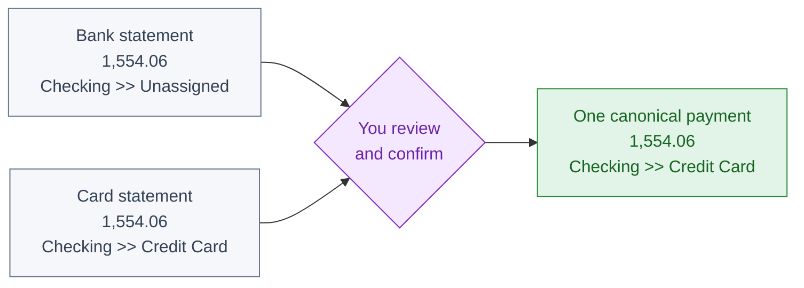

# Merge Duplicates

Merge Duplicates finds transaction rows that may describe the **same real-world movement** and lets you combine them safely.

Duplicate rows can appear when the same movement reaches a Book through different imports or entries. Merge Duplicates compares likely matches, shows them side by side, and changes only the pairs you explicitly confirm.

> **Nothing is merged during the scan.** Every suggested pair requires human review and final confirmation.

## One card payment, two imported rows

Suppose the same card payment appears in both statement imports. One row may still be a draft because the other side of its movement has not been assigned:

| Source | Status | Date | Amount | From | | To | Description |
| --- | --- | --- | ---: | --- | --- | --- | --- |
| Bank statement | Draft | 27 Jul | **1,554.06** | Checking `Asset` | >> | Unassigned | Scheduled card payment |
| Card statement | Posted | 27 Jul | **1,554.06** | Checking `Asset` | >> | Credit Card `Liability` | Payment received from checking |



The two statements describe the same movement: `Checking >> Credit Card`. It is not a second expense or a second payment. After you confirm, Bkper creates one canonical transaction and schedules the two imported originals to move to Trash. The bank balance decreases and the card balance is settled once, while the Book remains balanced.

## How to use it

1. Open a Book and set the transaction query you want to review. Selecting an Account or Group narrows the context and makes learning more relevant.
2. Choose **Merge Duplicates** from the Book menu.
3. Compare each suggested pair. Suggestions start selected, so **unselect every pair that is not a duplicate**.
4. Choose **Look for more** to review up to 200 more transactions. The app keeps your decisions for pairs that remain in the results and can scan up to 1,000 transactions.
5. Choose **Apply**, check the selected and unselected totals, and confirm.

Selected pairs are merged one at a time. If one pair fails, the app reports it and continues with the remaining pairs.

## What can be suggested

A pair must first pass deterministic checks:

- the amounts are equal;
- the dates are no more than seven calendar days apart; and
- the transactions share an Account on the same side of the movement, or at least one is a draft and both have descriptions that can be compared.

Bkper AI then compares all plausible alternatives and returns only its strongest non-overlapping pairs, labeled **Strong** or **Possible**. Checked, trashed, locked, and malformed transactions are not suggested.

## Human control and learning

The app never merges automatically. Only selected pairs from the final confirmation are sent through Bkper's canonical transaction merge, preserving the Book's balanced movement model.

When an Owner or Editor applies a review, unselected pairs are kept as plain-text examples in the visible `merge_duplicate_examples` property on the selected Account, Group, or Book. These examples help future reviews avoid similar false matches. The latest 50 examples are retained.

Post collaborators can analyze and merge, but learning examples are not saved. Viewers cannot scan, analyze, or merge transactions.

<details data-toc>
<summary><strong>API access</strong></summary>

Authenticated clients can use the same review workflow through the public API.

```text
Production: https://merge-duplicates.bkper.app
Preview:    https://merge-duplicates-preview.bkper.app
OpenAPI:    https://merge-duplicates.bkper.app/openapi.json
```

All requests require a Bkper OAuth bearer token. A safe integration should:

1. submit up to 1,000 canonical Book transactions for analysis;
2. present the returned non-overlapping suggestions for human review;
3. call the merge operation only after explicit confirmation; and
4. optionally save rejected pairs as learning examples.

| Operation | Route | Effect |
| --- | --- | --- |
| Analyze transactions | `POST /api/v1/analyze` | Returns suggestions without changing transactions |
| Merge a confirmed pair | `POST /api/v1/merge` | Creates one canonical transaction and schedules cleanup of the originals |
| Save rejected pairs | `POST /api/v1/learn` | Updates `merge_duplicate_examples` on the requested context |

Minimal analysis example:

```bash
# Run `bkper auth login` first if needed
TOKEN="$(bkper auth token)"

curl -X POST \
  -H "Authorization: Bearer ${TOKEN}" \
  -H "Content-Type: application/json" \
  -d '{
    "bookId": "<book-id>",
    "transactions": [
      {
        "id": "<transaction-id-1>",
        "date": "2026-07-27",
        "amount": "1554.06",
        "description": "Scheduled card payment",
        "posted": false,
        "creditAccount": { "id": "<checking-account-id>", "name": "Checking", "type": "ASSET" }
      },
      {
        "id": "<transaction-id-2>",
        "date": "2026-07-27",
        "amount": "1554.06",
        "description": "Payment received from checking",
        "posted": true,
        "creditAccount": { "id": "<checking-account-id>", "name": "Checking", "type": "ASSET" },
        "debitAccount": { "id": "<card-account-id>", "name": "Credit Card", "type": "LIABILITY" }
      }
    ]
  }' \
  https://merge-duplicates.bkper.app/api/v1/analyze
```

After a person explicitly confirms a suggested pair, `/api/v1/merge` needs only the two transaction IDs:

```json
{
  "bookId": "<book-id>",
  "primary": { "id": "<transaction-id-1>" },
  "secondary": { "id": "<transaction-id-2>" }
}
```

For `/api/v1/learn`, reuse the unchanged full transaction payloads from a rejected suggestion so the saved example retains useful context:

```ts
const [first, second] = rejectedSuggestion.transactions;

const learnRequest = {
    bookId: '<book-id>',
    accountId: '<account-id>', // Or groupId; omit both to learn at Book level.
    examples: [[first, second]],
};
```

Learning requires Owner or Editor permission and updates the visible `merge_duplicate_examples` property.

See the [OpenAPI specification](https://merge-duplicates.bkper.app/openapi.json) for complete request and response schemas.

</details>
