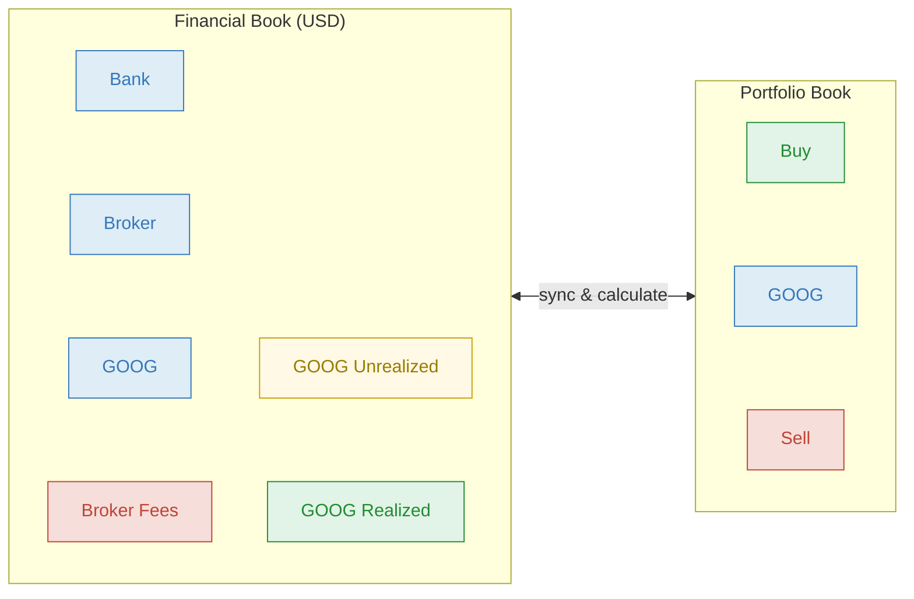
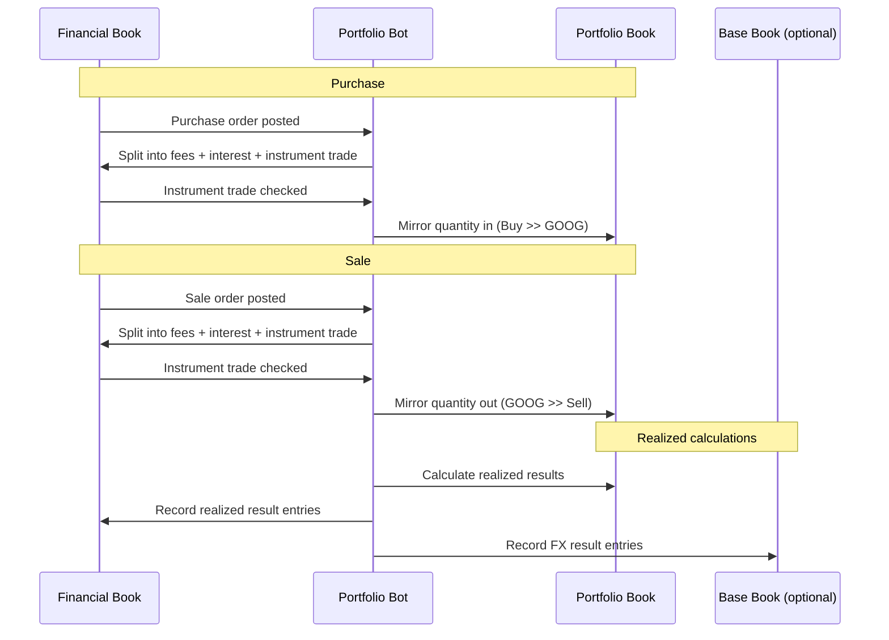
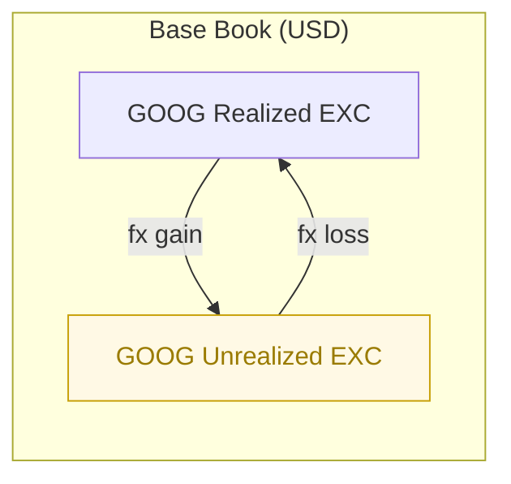

# Portfolio Bot

The Portfolio Bot tracks investment portfolios by splitting trade orders on Financial Books, mirroring checked quantities into a dedicated Portfolio Book, and calculating realized gains/losses using FIFO.

It works well for stocks and other traded instruments, and it can also split explicit `interest` amounts on trades, which is useful for bond-style dirty/clean price workflows. Broader coupon schedules, accrual calendars, tax logic, reconciliation flows, and report generation remain external to this bot.

## How it works

The bot operates across one shared Portfolio Book and one or more Financial Books in the same [Collection](https://bkper.com/docs/guides/using-bkper/books):

- **Financial Book(s)** — record money flowing in and out, typically one per currency
- **Portfolio Book** — tracks quantities (units bought, units sold) managed by the bot
- **Base Book** *(optional but recommended for multi-currency FX separation)* — one Financial Book marked with `exc_base: true` to receive exchange gain/loss entries

> Use only **one** Portfolio Book per collection.



The lifecycle has three main stages:

1. **Post** — you post a purchase or sale order on a Financial Book. The bot splits it into fees, interest (if any), and the actual instrument trade.
2. **Check** — you check the instrument trade on the Financial Book. The bot mirrors the quantity to the Portfolio Book.
3. **Calculate / Reset / Forward Date** — from the Portfolio Book menu, you run FIFO calculations, rebuild/reset state, and optionally carry open positions forward.



In Bkper, any countable resource can move between accounts. On the Financial Book the resource is **money**; on the Portfolio Book the resource is **quantity** (shares or units). The transaction `amount` on the Portfolio Book is the number of units, while monetary values from the Financial Book are stored as transaction properties.

The bot auto-creates several **support accounts** (Unrealized, Realized, FX, Forwarded, MTM). Their account types affect how Bkper groups aggregate them:

- **Asset / Liability** → permanent balances; mixed groups display as **Equity** (gray).
- **Incoming / Outgoing** → period activity; mixed groups display as **Net Result**.

> The Portfolio Book is bot-managed. Do **not** manually post or edit quantity transactions there. Use the Portfolio Book only to run the Portfolio Bot menu.

> If the bot auto-creates a new instrument account on a Financial Book, assign that account to a group with `stock_exc_code` **before checking** the instrument trade. Otherwise, the Portfolio Book mirror will be skipped.

## Purchase

You buy 1 share of GOOG for 165 with no fees. Post the order on the Financial Book, then check the instrument trade.

**You post the purchase order:**

```
05/06  165  Bank  >>  Broker  buy  instrument: GOOG  quantity: 1  trade_date: 05/07/2025
```

**The bot splits** (on `TRANSACTION_POSTED`) into a fees transaction if needed and the actual trade:

| # | Book | Amount | From | | To | Properties |
|---|---|---|---|---|---|---|
| You | Financial | **165** | Bank `Asset` | >> | Broker `Asset` | `instrument: GOOG` `quantity: 1` `trade_date: 05/07/2025` |
| Bot | Financial | **165** | Broker `Asset` | >> | GOOG `Asset` | `quantity: 1` `price: 165` `settlement_date: 05/06/2025` |

**You check** the instrument trade (`Broker >> GOOG`). The bot mirrors the quantity:

| # | Book | Amount | From | | To | Properties |
|---|---|---|---|---|---|---|
| Bot | Portfolio | **1** | Buy `Incoming` | >> | GOOG `Asset` | `purchase_price: 165` `original_amount: 165` `stock_exc_code: USD` |

> On the Portfolio Book, the Bkper transaction `amount` is the **quantity in units**. The original monetary amount from the Financial Book is preserved as the `original_amount` property.
>
> The bot sets the instrument trade's Bkper `date` to the `trade_date` you provided. The original posting date is preserved as the `settlement_date` property.

The Portfolio Book now shows 1 unit of GOOG. The Financial Book shows 165 in GOOG.

## Sale

You sell 1 share of GOOG for 180. Post the order, then check the trade.

**You post the sale order:**

```
05/15  180  Broker  >>  Bank  sell  instrument: GOOG  quantity: 1  trade_date: 05/16/2025
```

| # | Book | Amount | From | | To | Properties |
|---|---|---|---|---|---|---|
| You | Financial | **180** | Broker `Asset` | >> | Bank `Asset` | `instrument: GOOG` `quantity: 1` `trade_date: 05/16/2025` |
| Bot | Financial | **180** | GOOG `Asset` | >> | Broker `Asset` | `quantity: 1` `price: 180` `settlement_date: 05/15/2025` |

**You check** the instrument trade (`GOOG >> Broker`). The bot mirrors the quantity:

| # | Book | Amount | From | | To | Properties |
|---|---|---|---|---|---|---|
| Bot | Portfolio | **1** | GOOG `Asset` | >> | Sell `Outgoing` | `sale_price: 180` `original_amount: 180` `stock_exc_code: USD` |

> As with purchases, the Portfolio Book `amount` is the **quantity in units**; the monetary value is the `original_amount` property.

## Fees and interest

When the order includes `fees` or `interest`, the bot posts separate transactions for each before the instrument trade.

- **Fees** go to the account defined by `stock_fees_account` on the broker/exchange account.
- **Interest** goes to or from `<Instrument> Interest` on the Financial Book.
- The instrument trade amount excludes explicit interest and reconstructs the trade amount apart from fees.

> The bot auto-creates `<Instrument> Interest` as an **Asset** account. This models accrued interest as a recoverable position (prepaid/receivable), not as period income or expense. If you need it as Incoming/Outgoing, create the account manually before posting the first interest-bearing trade.

**Purchase with fees:**

```
05/06  175  Bank  >>  Broker  buy  instrument: GOOG  quantity: 1  trade_date: 05/07/2025  fees: 10
```

| # | Book | Amount | From | | To |
|---|---|---|---|---|---|
| You | Financial | **175** | Bank `Asset` | >> | Broker `Asset` |
| Bot | Financial | **10** | Broker `Asset` | >> | Broker Fees `Outgoing` |
| Bot | Financial | **165** | Broker `Asset` | >> | GOOG `Asset` |

This same mechanism can be used for bond-style trades by passing explicit `interest`, but the bot does not manage coupon schedules or accrual calendars on its own.

## Gain/Loss updates

The portfolio lifecycle involves four result layers:

1. **Unrealized** (Mark-to-Market) — periodic valuation adjustments, usually recorded externally
2. **Realized** — gains/losses recognized on sale, calculated by the bot using FIFO
3. **Exchange** — FX gains/losses separated on the Base Book when `exc_base: true` is configured
4. **Period closing** — by full liquidation in historical-only mode or by Forward Date in fair/both modes

### Unrealized gain/loss (Mark-to-Market)

To periodically report the portfolio position, unrealized gains and losses are tracked on the Financial Book — typically once a month, prior to reporting. This adjusts each instrument's monetary value to reflect current market price.

Regular mark-to-market is usually done **externally** (for example with valuation spreadsheets) by recording transactions between the instrument account and its Unrealized account:


| Scenario | Amount | From | | To | Description |
|---|---|---|---|---|---|
| Value went up | **15** | GOOG Unrealized `Liability` | >> | GOOG `Asset` | `#mtm` |
| Value went down | **10** | GOOG `Asset` | >> | GOOG Unrealized `Liability` | `#mtm` |

Unrealized accounts represent **unsettled positions** — you have not actually gained or lost anything until the instrument is liquidated. Conceptually this is a Liability (or contra-Asset), so the bot auto-creates `... Unrealized` accounts as **Liability** by default. If you group a Liability-type `GOOG Unrealized` with Asset accounts, Bkper displays the mixed group balance as **Equity** (gray). If you prefer Unrealized to appear as period activity, create the first `... Unrealized` account manually as **Incoming** before the bot runs.

The bot infers the type for new support accounts by scanning existing accounts with the same suffix in the book and picking the most common type. Because the default starts at Liability, you need **at least two** manually-created Incoming Unrealized accounts before the bot will switch to creating subsequent ones as Incoming.

For instruments with an explicit interest leg, the associated interest accounts (`<Instrument> Interest` / `<Instrument> Interest Unrealized`) follow the same pattern.

#### Optional auto-MTM during calculation

In the Portfolio Book menu, **Calculate** offers a **Perform `#mtm` valuations?** checkbox.

When enabled, the bot may create supporting bot-generated entries such as:

- `#mtm`
- `#interest_mtm`

These help align processed lots and clear residual interest balances during the realized-results workflow. They complement — not replace — your broader external valuation process.

### Realized gain/loss

At sale, unrealized gains/losses become realized. The bot creates `... Realized` and `... Realized Hist` accounts as **Incoming**, because they represent recognized period activity. Open the Portfolio Book and select **More > Portfolio Bot**. Choose the account(s), set the date, and click **Calculate**.

The bot then:

- matches sales to purchases in FIFO order
- can split quantity transactions when only part of a lot is consumed
- stores lot-matching logs on the Portfolio Book
- records realized gain/loss transactions on the Financial Book


| Scenario | Amount | From | | To | Description |
|---|---|---|---|---|---|
| Gain (sold above cost) | **15** | GOOG Realized `Incoming` | >> | GOOG Unrealized `Liability` | `#stock_gain` |
| Loss (sold below cost) | **10** | GOOG Unrealized `Liability` | >> | GOOG Realized `Incoming` | `#stock_loss` |

In **Both** mode, the bot also creates historical companion entries using separate historical accounts and hashtags:

- `#stock_gain_hist`
- `#stock_loss_hist`

#### Short sales

If a sale occurs before the covering purchase, the bot treats it as a short-sale workflow.

When the covering purchase arrives, the bot matches it back to the earlier sale, marks the Portfolio Book transaction with `short_sale: true`, and records the realized result on that coverage.

### Exchange gain/loss (multi-currency)

When a **Base Book** is explicitly configured with `exc_base: true`, the bot separates exchange-rate variation from instrument-price variation. Realized FX gains/losses are recorded on the Base Book.



| Scenario | Book | Amount | From | | To | Description |
|---|---|---|---|---|---|---|
| FX gain | Base | **5** | GOOG Realized EXC `Incoming` | >> | GOOG Unrealized EXC `Liability` | `#exchange_gain` |
| FX loss | Base | **3** | GOOG Unrealized EXC `Liability` | >> | GOOG Realized EXC `Incoming` | `#exchange_loss` |

Unrealized FX accounts (`... Unrealized EXC`) default to **Liability**, just like regular Unrealized accounts. Realized FX accounts (`... Realized EXC`, `Exchange_XXX`) conceptually represent recognized period activity and should be **Incoming**, though the current type-inference behavior may group them together.

In **Both** mode, the bot also creates historical companion FX entries:

- `#exchange_gain_hist`
- `#exchange_loss_hist`

> For reliable FX separation, explicitly configure one Financial Book with `exc_base: true`. The code does have some USD fallback lookups, but that is **not** the same as running in a fully configured Base Book mode.

Advanced FX routing options such as `exc_aggregate` and `exc_account` are described below.

### Calculation models

The bot supports three calculation models controlled by Portfolio Book properties:

- **Both** (default) — calculates using both fair and historical cost basis. Creates additional historical result accounts such as `Unrealized Hist`, `Realized Hist`, and historical FX companions when applicable.
- **Historical only** (`stock_historical: true`) — uses only historical cost and rates.
- **Fair only** (`stock_fair: true`) — uses only fair/market cost and rates.

If neither `stock_historical` nor `stock_fair` is set, the bot calculates using **Both**.

Transaction cost properties are **optional overrides**, not mandatory requirements:

- `cost_hist` — overrides the historical local cost used by the historical branch
- `cost_base` — fixes a fair/base-currency cost so the bot can derive a specific fair exchange rate for the trade
- `cost_hist_base` — fixes a historical/base-currency cost so the bot can derive a specific historical exchange rate for the trade

If these overrides are omitted, the bot falls back to the trade values already stored on the instrument transactions and other available connected data.

## Forward date

For **Fair only** or **Both** calculation models, open positions must be carried forward to the next period by setting a forward date in the Portfolio Book. This is not needed for historical-only books, where a period closes naturally when an instrument is fully liquidated.

Open the Portfolio Book, select the account(s), choose **More > Portfolio Bot**, set the date, and click **Set Forward Date**. The bot then:

1. copies each unchecked Portfolio Book transaction as a forward log entry
2. updates the original transaction's date, order, forward price, and forward exchange-rate properties
3. may create a liquidation bridge transaction in the Portfolio Book to carry open quantity to the new period
4. records a **Forwarded Results** transaction on the Financial Book to bridge the unrealized gap *(fair/both only)*
5. stores the new forward state on the account (`forwarded_date`, `forwarded_price`, `forwarded_exc_rate`)
6. sets a closing date on the Portfolio Book to one day before the forward date once all active accounts share that same forward date

The bot records forwarded results against a `<Instrument> Forwarded` account, which it creates as **Liability** by default.

After forwarding, future FIFO calculations use the forwarded valuation as the new baseline.

### Forward-date restrictions

The bot blocks forwarding when:

- the account is flagged with `needs_rebuild`
- the account still has uncalculated results
- the requested forward date is equal to or earlier than the current realized date
- the requested forward date is the same as the current forwarded date

Lowering an already-set forward date is an advanced repair flow and requires:

- **OWNER** permission on the Portfolio Book
- an unlocked/unclosed collection

## Configuration

<details>
<summary><strong>Book properties</strong></summary>

**Financial Book(s):**

| Property | Required | Description |
|---|---|---|
| `exc_code` | Yes | Currency code of the Financial Book, for example `USD` or `EUR`. The bot also accepts the legacy key `exchange_code`. |

**Portfolio Book:**

| Property | Required | Description |
|---|---|---|
| `stock_book` | No | Explicitly marks this book as the Portfolio Book. If omitted, the bot falls back to detecting the Portfolio Book by `0` fraction digits. |
| `stock_historical` | No | Set to `true` to calculate realized results using only historical cost/rates. The bot propagates this to the Base Book as `exc_historical`. |
| `stock_fair` | No | Set to `true` to calculate realized results using only fair/market cost/rates. |

If neither `stock_historical` nor `stock_fair` is set, the bot uses **Both**.

**Base Book** *(advanced / recommended for multi-currency collections)*:

| Property | Required | Description |
|---|---|---|
| `exc_base` | No | Marks one Financial Book as the Base Book. Use this when you want stock-price results separated from exchange-rate results. |
| `exc_aggregate` | No | Advanced. Aggregates realized FX result accounts by currency on the Base Book (for example `Exchange_USD` / `Exchange_USD Hist`) instead of routing them to per-instrument `... EXC` realized accounts. |

All participating books must be in the same [Collection](https://bkper.com/docs/guides/using-bkper/books).

</details>

<details>
<summary><strong>Group properties</strong></summary>

Every instrument account must belong to a group with:

| Property | Required | Description |
|---|---|---|
| `stock_exc_code` | Yes | Currency code of the instrument group. Only transactions from/to accounts in groups with this property are mirrored to the Portfolio Book. |
| `exc_account` | No | Advanced. On Base Book FX-support groups, overrides the realized FX account name that should receive exchange-result postings. |

```yaml
# Group: NASDAQ (Financial Book)
stock_exc_code: USD
```

The Portfolio Book must have matching groups with the same `stock_exc_code`. The bot mirrors **group records** between books — create, update, and delete by name plus visible properties/hidden flag — but it does **not** sync parent/child hierarchy.

> The `stock_exc_code` value on a Portfolio Book group must match the `exc_code` on the corresponding Financial Book.

</details>

<details>
<summary><strong>Account properties</strong></summary>

The broker/exchange account requires a fees account:

| Property | Required | Description |
|---|---|---|
| `stock_fees_account` | Yes | Name of the fees account associated with this broker. The bot identifies broker/exchange accounts by the presence of this property. |
| `exc_account` | No | Advanced. On Base Book FX-support accounts, overrides the realized FX account name that should receive exchange-result postings. |

```yaml
# Account: Broker (Financial Book)
stock_fees_account: Broker Fees
```

> `stock_fees_account` is required even if you do not record fees. It is how the bot recognizes the broker/exchange side of an order.

> The bot can auto-create missing instrument accounts on Financial Books, but it does **not** infer their `stock_exc_code` grouping. Assign the new account to the correct group before checking the instrument trade.

</details>

<details>
<summary><strong>Transaction properties</strong></summary>

Transactions representing purchase or sale orders use these properties:

| Property | Required | Description |
|---|---|---|
| `instrument` | Yes | Instrument name or ticker, for example `GOOG`. The bot can create a Financial Book account with this name if it does not exist yet. |
| `quantity` | Yes | Number of units in the operation. Must not be zero. |
| `trade_date` | Yes | Trade date used on the instrument trade and mirrored Portfolio Book quantity transaction. |
| `order` | No | FIFO ordering helper when multiple operations happen on the same day. |
| `fees` | No | Portion of the order amount corresponding to fees. |
| `interest` | No | Portion of the order amount corresponding to interest. |
| `cost_hist` | No | Optional historical local cost override used by the historical calculation branch. |
| `cost_base` | No | Optional fair/base-currency cost override used to derive a specific fair trade exchange rate. |
| `cost_hist_base` | No | Optional historical/base-currency cost override used to derive a specific historical trade exchange rate. |

> `cost_base` and `cost_hist_base` are only useful when a Base Book is explicitly configured with `exc_base: true`.
>
> The bot also derives and stores these properties automatically on the instrument trade transaction:
>
> - `price` — calculated from the trade amount divided by quantity.
> - `price_hist` — derived when `cost_hist` is provided in Both mode.
> - `trade_exc_rate` — derived when `cost_base` is provided.
> - `trade_exc_rate_hist` — derived when `cost_hist_base` is provided in Both mode.
> - `settlement_date` — the original posting date, preserved when the transaction date is moved to `trade_date`.
> - `fees` and `interest` — copied from the original order for reference.

</details>

## Operational constraints

Before running the bot in production, keep these operating rules in mind:

- all books must live in the same collection
- only one Portfolio Book should exist per collection
- users need **EDITOR** or **OWNER** permission in the relevant Financial Books to run calculations for those currencies
- the Portfolio Book must not have pending backlog tasks when starting **Calculate**, **Reset**, **Full Reset**, or **Forward Date**
- locked transactions, locked books, or closed books can block reset/calculate/forward flows
- **Full Reset** and lowering an existing forward date are reserved for stricter operational conditions described below

## Advanced

<details>
<summary><strong>Reset</strong></summary>

Use **Reset** to revert realized-result, FX-result, and related MTM entries back to the last forward date — or to the start of the account history if no forward date exists.

Reset keeps the forward baseline itself. Use it when you need to rebuild FIFO after historical edits or incorrect calculations.

> If the [Exchange Bot](https://github.com/bkper/bkper-apps/tree/main/exchange-bot) is also installed on the collection, Reset does not undo Exchange Bot entries. Handle those separately.

</details>

<details>
<summary><strong>Full Reset</strong></summary>

**Full Reset** goes further than Reset. It also removes forward state and restores the pre-forward transaction state, including forwarded logs and forward-specific properties.

This option is only exposed when:

- the current user is **OWNER** on the Portfolio Book, and
- all books in the collection are unlocked and not closed

Use Full Reset when you need to undo forward-date processing itself, not just the realized/FX results built on top of it.

</details>

<details>
<summary><strong>Rebuild flag</strong></summary>

The bot flags an account with `needs_rebuild: TRUE` whenever historical changes could alter FIFO matching.

Typical triggers include:

- checking a Financial Book instrument trade dated on or before the account's last realized date
- manually checking or unchecking a Portfolio Book quantity transaction
- updating or deleting linked transactions whose date falls inside already-realized history

To resolve:

1. confirm the historical change is correct
2. run **Reset** (or **Full Reset** if you must undo forwarding)
3. run **Calculate** again

The flag clears automatically during reset.

</details>

<details>
<summary><strong>Portfolio Book internals</strong></summary>

During FIFO calculation and forward-date processing, the bot may:

- split partially matched purchases or sales into child transactions
- write purchase and liquidation logs on Portfolio Book transactions
- create forward log entries that preserve prior transaction state
- create liquidation bridge transactions used to carry open quantity to the next period

This is expected behavior. It is also why the Portfolio Book should not be edited manually.

</details>

<details>
<summary><strong>Events handled</strong></summary>

| Event | Behavior |
|---|---|
| `TRANSACTION_POSTED` | Splits purchase/sale orders into fees, interest, and instrument-trade transactions on the Financial Book. Ignores Exchange Bot transactions. |
| `TRANSACTION_CHECKED` | Mirrors checked instrument-trade quantities to the Portfolio Book (`Buy` / `Sell`). Also flags rebuild for any instrument trade dated on or before the account's realized date, or for any manual check/uncheck on the Portfolio Book by a non-bot user. |
| `TRANSACTION_UPDATED` | Reprocesses derived order splits when core order fields change and updates the linked Portfolio Book quantity transaction when a mirrored record exists. |
| `TRANSACTION_DELETED` | Cascades linked deletions across Financial, Portfolio, and Base Books as applicable, and flags rebuild when needed. |
| `TRANSACTION_RESTORED` | Restores linked trashed transactions where a matching remote record exists. |
| `TRANSACTION_UNCHECKED` | Flags the affected account for rebuild whenever a Portfolio Book quantity transaction is manually unchecked by a non-bot user. |
| `ACCOUNT_CREATED` | Mirrors matching instrument accounts into the Portfolio Book when they belong to a `stock_exc_code` group. |
| `ACCOUNT_UPDATED` | Updates the mirrored Portfolio Book account metadata. |
| `ACCOUNT_DELETED` | Removes or archives the mirrored Portfolio Book account depending on whether it already has posted history. |
| `GROUP_CREATED` | Mirrors matching groups into the Portfolio Book. |
| `GROUP_UPDATED` | Updates mirrored group properties/hidden status. |
| `GROUP_DELETED` | Deletes the mirrored group from the Portfolio Book. |
| `BOOK_UPDATED` | Propagates book-level mode changes such as historical/base-book settings. |

> Group syncing mirrors group records and properties, but not parent/child hierarchy.

> The bot ignores transactions originating from the Exchange Bot to avoid duplication.

</details>

<details>
<summary><strong>Bot-managed properties</strong></summary>

The bot automatically adds and maintains properties on Portfolio Book transactions and related support accounts during calculation, reset, and forwarding. Do **not** edit them manually.

Common bot-managed keys include:

- pricing / amount state: `purchase_price`, `sale_price`, `purchase_amount`, `sale_amount`, `original_quantity`, `original_amount`, `price`, `price_hist`
- fees and interest: `fees`, `interest`, `settlement_date`
- historical companions: `gain_amount`, `gain_amount_hist`, `purchase_price_hist`, `sale_price_hist`
- FIFO logs: `purchase_log`, `fwd_purchase_log`, `liquidation_log`, `parent_id`, `short_sale`
- exchange-rate state: `purchase_exc_rate`, `sale_exc_rate`, `fwd_purchase_exc_rate`, `fwd_sale_exc_rate`, `trade_exc_rate`, `trade_exc_rate_hist`
- forward state: `forwarded_date`, `forwarded_price`, `forwarded_exc_rate`, `fwd_purchase_price`, `fwd_sale_price`, `fwd_log`, `fwd_liquidation`, `fwd_purchase_amount`, `fwd_sale_amount`, `fwd_tx`, `fwd_tx_remote_ids`
- historical preservation: `hist_quantity`, `hist_order`, `date`
- result metadata: `exc_amount`, `exc_code`
- control flags: `realized_date`, `needs_rebuild`, `open_quantity`

This list is not exhaustive, but these are the main properties you will see while operating the bot.

</details>

## Template

Explore the template books to see the Portfolio Bot in action:

- [Financial Book (USD)](https://app.bkper.com/b/#transactions:bookId=agtzfmJrcGVyLWhyZHITCxIGTGVkZ2VyGICA4MjCmacJDA)
- [Portfolio Book](https://app.bkper.com/b/#transactions:bookId=agtzfmJrcGVyLWhyZHITCxIGTGVkZ2VyGICA4Jja2KcJDA)

> To use the template, make a copy, place the books in a collection, and install the Portfolio Bot on all books.

## Learn more

- [Structuring Books & Collections](https://bkper.com/docs/guides/accounting-principles/modeling/structuring-books-collections) — how bots connect books for consolidated reporting
