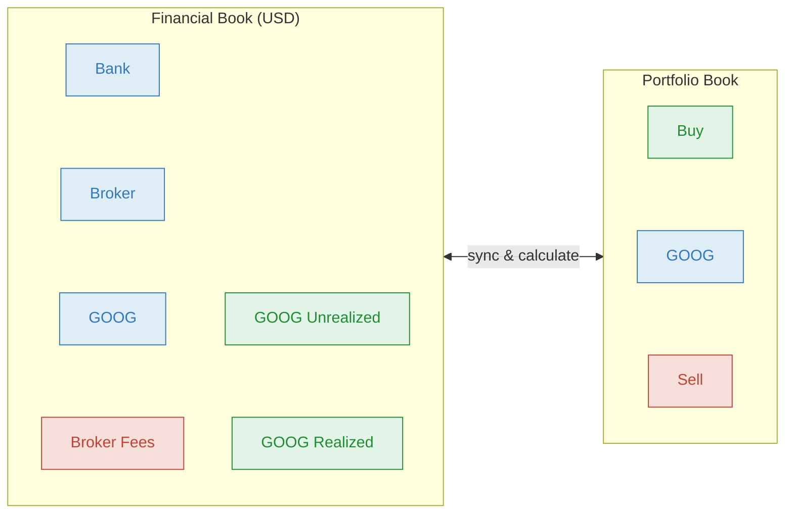
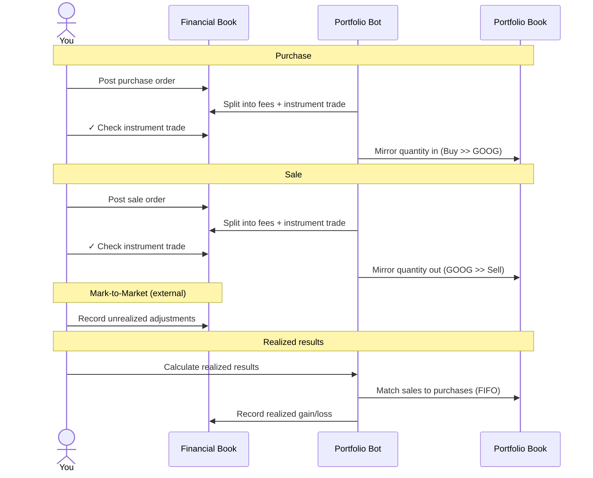
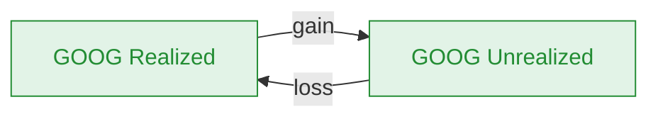
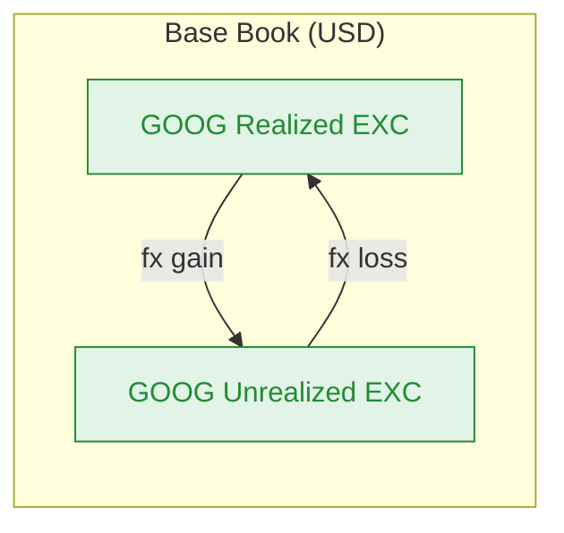

# Portfolio Bot

The Portfolio Bot tracks investment portfolios by synchronizing trades between Financial Books (which track money) and a dedicated Portfolio Book (which tracks quantities). It splits orders into fees and instrument trades, mirrors quantities on check, and calculates realized gains/losses using FIFO.

## How it works

The bot operates across one shared Portfolio Book and one or more Financial Books in the same [Collection](https://bkper.com/docs/guides/using-bkper/books):

- **Financial Book(s)** — record money flowing in and out (purchases, sales, fees), typically one per currency
- **Portfolio Book** — tracks quantities (units bought, units sold) managed by the bot



The bot uses a two-phase trigger:

1. **Post** — you post a purchase or sale order. The bot splits it into separate transactions: fees, interest (if any), and the actual instrument trade.
2. **Check** — you check the instrument trade. The bot mirrors the quantity to the Portfolio Book.



> The Portfolio Book is managed entirely by the bot. Only make edits on the Financial Book.

## Purchase

You buy 1 share of GOOG for 165 with no fees. Post the order on the Financial Book, then check the instrument trade:

**You post the purchase order:**

```
05/06  165  Bank  >>  Broker  buy  instrument: GOOG  quantity: 1  trade_date: 05/07/2025
```

**The bot splits** (on Post event) — a fees transaction (if any) and the actual trade:

| # | Book | Amount | From | | To | Properties |
|---|---|---|---|---|---|---|
| You | Financial | **165** | Bank `Asset` | >> | Broker `Asset` | `instrument: GOOG` `quantity: 1` `trade_date: 05/07/2025` |
| Bot | Financial | **165** | Broker `Asset` | >> | GOOG `Asset` | `quantity: 1` `price: 165` `settlement_date: 05/06/2025` |

**You check** the instrument trade (`Broker >> GOOG`). The bot mirrors the quantity:

| # | Book | Amount | From | | To | Properties |
|---|---|---|---|---|---|---|
| Bot | Portfolio | **1** | Buy `Incoming` | >> | GOOG `Asset` | `purchase_price: 165` `original_amount: 165` `stock_exc_code: USD` |

The Portfolio Book now shows 1 unit of GOOG. The Financial Book shows 165 in GOOG.

## Sale

You sell 1 share of GOOG for 180. Post the order, then check the trade:

**You post the sale order:**

```
05/15  180  Broker  >>  Bank  sell  instrument: GOOG  quantity: 1  trade_date: 05/16/2025
```

| # | Book | Amount | From | | To | Properties |
|---|---|---|---|---|---|---|
| You | Financial | **180** | Broker `Asset` | >> | Bank `Asset` | `instrument: GOOG` `quantity: 1` `trade_date: 05/16/2025` |
| Bot | Financial | **180** | GOOG `Asset` | >> | Broker `Asset` | `quantity: 1` `price: 180` `settlement_date: 05/15/2025` |

**You check** the instrument trade (`GOOG >> Broker`). The bot mirrors the quantity:

| # | Book | Amount | From | | To | Properties |
|---|---|---|---|---|---|---|
| Bot | Portfolio | **1** | GOOG `Asset` | >> | Sell `Outgoing` | `sale_price: 180` `original_amount: 180` `stock_exc_code: USD` |

## Fees and interest

When the order includes `fees` or `interest`, the bot posts separate transactions for each before the instrument trade. The instrument trade amount excludes fees and interest.

**Purchase with fees:**

```
05/06  175  Bank  >>  Broker  buy  instrument: GOOG  quantity: 1  trade_date: 05/07/2025  fees: 10
```

| # | Book | Amount | From | | To |
|---|---|---|---|---|---|
| You | Financial | **175** | Bank `Asset` | >> | Broker `Asset` |
| Bot | Financial | **10** | Broker `Asset` | >> | Broker Fees `Outgoing` |
| Bot | Financial | **165** | Broker `Asset` | >> | GOOG `Asset` |

The fees account is determined by the `stock_fees_account` property on the broker account.

## Gain/Loss updates

The portfolio lifecycle involves three types of gain/loss updates that adjust the book's equity:

1. **Unrealized** (Mark-to-Market) — periodic adjustments to reflect current market values, done externally
2. **Realized** — gains/losses recognized on sale, calculated by the bot using FIFO
3. **Period closing** — depends on the calculation model: full liquidation (historical) or forward date (fair/both)

In multi-currency setups, the bot also separates exchange rate variations from instrument price movements.

### Unrealized gain/loss (Mark-to-Market)

To periodically report the portfolio position, unrealized gains and losses are tracked — typically once a month, prior to reporting. This adjusts each instrument's monetary value on the Financial Book to reflect its current market price.

Mark-to-market is done **externally** (e.g. via valuation spreadsheets) by recording transactions between the instrument account and its Unrealized account:


| Scenario | Amount | From | | To | Description |
|---|---|---|---|---|---|
| Value went up | **15** | GOOG Unrealized `Incoming` | >> | GOOG `Asset` | #mtm |
| Value went down | **10** | GOOG `Asset` | >> | GOOG Unrealized `Incoming` | #mtm |

The Unrealized accounts should be grouped outside the equity group so they **show up as equity increases or decreases on the Financial Statements**.

For bonds, associated interest accounts (`GOOG Interest` / `GOOG Interest Unrealized`) follow the same pattern.

### Realized gain/loss

At sale, unrealized gains/losses become realized. Open the Portfolio Book and select **More > Portfolio Bot**. Choose the account(s), set the date, and click **Calculate**. The bot matches sales to purchases in FIFO order, calculates the gain or loss per lot, and records transactions between the Realized and Unrealized accounts on the Financial Book.



| Scenario | Amount | From | | To | Description |
|---|---|---|---|---|---|
| Gain (sold above cost) | **15** | GOOG Realized `Incoming` | >> | GOOG Unrealized `Incoming` | #stock_gain |
| Loss (sold below cost) | **10** | GOOG Unrealized `Incoming` | >> | GOOG Realized `Incoming` | #stock_loss |

The Unrealized balance decreases as gains/losses are realized, while the Realized account accumulates the recognized income.

### Period closing

How a period closes depends on the calculation model:

- **Historical only** — the period closes naturally when an instrument is fully liquidated (sold down to zero). At that point, realized results reflect the full gain/loss and the unrealized balance is already zero. No forward date is needed.
- **Fair or Both** — use the [Forward Date](#forward-date) mechanism to carry remaining positions forward to the next period, preserving the FIFO baseline at current valuations.

### Exchange gain/loss (multi-currency)

In multi-currency collections with a Base Book, the bot separates exchange rate variations from instrument price movements. When calculating realized results, the bot also records FX gains/losses on the **Base Book** between dedicated exchange accounts.



| Scenario | Book | Amount | From | | To | Description |
|---|---|---|---|---|---|---|
| FX gain | Base | **5** | GOOG Realized EXC `Incoming` | >> | GOOG Unrealized EXC `Incoming` | #exchange_gain |
| FX loss | Base | **3** | GOOG Unrealized EXC `Incoming` | >> | GOOG Realized EXC `Incoming` | #exchange_loss |

This separation allows reporting instrument performance independently from currency fluctuations.

### Calculation models

The bot supports three calculation models controlled by Portfolio Book properties:

- **Both** (default) — calculates using both fair and historical cost basis. Creates additional accounts per instrument: `Unrealized Hist`, `Realized Hist`, and `MTM`
- **Historical only** (`stock_historical: true`) — uses only historical cost and rates
- **Fair only** (`stock_fair: true`) — uses only fair (market) cost and rates

When using both models, provide `cost_hist` (and optionally `cost_hist_base`) on transactions to supply the historical cost alongside the fair cost.

## Forward date

For fair or both calculation models, instruments must be carried forward to the next period by setting a forward date in the Portfolio Book. This is not needed for historical-only books, where the period closes naturally when instruments are fully liquidated.

Open the Portfolio Book, select the account(s), choose **More > Portfolio Bot**, set the forward date, and click **Set Forward Date**. The bot:

1. Copies each unprocessed transaction as a log entry
2. Updates the original transaction's date, price, and exchange rate to the current valuation
3. Records a "Forwarded Results" transaction to bridge the unrealized gap (fair/both models only)
4. Sets a closing date on the Portfolio Book one day before the forward date (once all accounts are forwarded)

After forwarding, future FIFO calculations use the new forward valuation as the cost basis.

> Calculate any remaining realized results before forwarding. The bot prevents forwarding accounts with uncalculated results.

## Configuration

<details>
<summary><strong>Book properties</strong></summary>

**Financial Book(s):**

| Property | Required | Description |
|---|---|---|
| `exc_code` | Yes | The exchange code representing the book's currency (e.g. `USD`, `EUR`). Also accepts legacy key `exchange_code` |

**Portfolio Book:**

| Property | Required | Description |
|---|---|---|
| `stock_book` | No | Set to `true` to identify this as the Portfolio Book. If not set, the bot identifies the Portfolio Book by 0 decimal places |
| `stock_historical` | No | Set to `true` to calculate realized results using **only** historical cost and rates |
| `stock_fair` | No | Set to `true` to calculate realized results using **only** fair (market) cost and rates |

If neither `stock_historical` nor `stock_fair` is set, the bot calculates using both models.

**Base Book** (optional):

| Property | Required | Description |
|---|---|---|
| `exc_base` | No | Set to `true` to designate a Financial Book as the Base Book. Used to separate exchange results from stock market results in multi-currency collections |

If no Base Book is defined, the bot falls back to the USD-denominated Financial Book.

All participating books must be in the same [Collection](https://bkper.com/docs/guides/using-bkper/books).

</details>

<details>
<summary><strong>Group properties</strong></summary>

Every instrument account must belong to a group with:

| Property | Required | Description |
|---|---|---|
| `stock_exc_code` | Yes | The exchange code representing the currency of the instruments. Only transactions from/to accounts in groups with this property will be mirrored |

```yaml
# Group: NASDAQ (Financial Book)
stock_exc_code: USD
```

The Portfolio Book must have matching groups with the same `stock_exc_code`. The bot syncs group structure between books.

> The `stock_exc_code` value on a Portfolio Book group must match the `exc_code` on the corresponding Financial Book.

</details>

<details>
<summary><strong>Account properties</strong></summary>

The broker/exchange account requires a fees account:

| Property | Required | Description |
|---|---|---|
| `stock_fees_account` | Yes | Name of the fees account associated with this broker. The bot identifies broker accounts by the presence of this property |

```yaml
# Account: Broker (Financial Book)
stock_fees_account: Broker Fees
```

> This property is required even if you do not record fees. It is how the bot identifies which account is the broker/exchange.

</details>

<details>
<summary><strong>Transaction properties</strong></summary>

Transactions representing purchase or sale orders need these properties:

| Property | Required | Description |
|---|---|---|
| `instrument` | Yes | The instrument name or ticker (e.g. `GOOG`). The bot creates an account with this name if it doesn't exist |
| `quantity` | Yes | Number of units in the operation. Must not be zero |
| `trade_date` | Yes | The date of the trade operation |
| `order` | No | Sequence number when multiple operations happen on the same day |
| `fees` | No | Amount included in the transaction corresponding to fees |
| `interest` | No | Amount included in the transaction corresponding to interest |
| `cost_hist` | No | Historical cost of the transaction. Required only when calculating in both historical and fair models |
| `cost_base` | No | Cost in the base currency. Fixes a specific exchange rate for the operation |
| `cost_hist_base` | No | Historical cost in the base currency. Fixes a specific historical exchange rate |

> `cost_base` and `cost_hist_base` are only needed when a Base Book is defined in the collection.

</details>

## Advanced

<details>
<summary><strong>Reset</strong></summary>

If you need to correct operations, use **Reset** in the Portfolio Bot menu to revert all realized result and exchange result transactions back to the last forward date (or the start of the book if no forward date exists).

> If the [Exchange Bot](https://github.com/bkper/bkper-apps/tree/main/exchange-bot) is also installed on the collection, reset does not undo Exchange Bot entries — those must be handled separately.

</details>

<details>
<summary><strong>Rebuild flag</strong></summary>

When you check a transaction dated on or before the last realized date (`realized_date`), the bot flags the instrument account with `needs_rebuild: TRUE`. This protects FIFO accuracy — historical changes would alter which purchases match which sales.

To resolve: verify the transaction is correct, then **Reset** and **Calculate** again. The flag clears automatically.

</details>

<details>
<summary><strong>Events handled</strong></summary>

| Event | Behavior |
|---|---|
| `TRANSACTION_POSTED` | Splits purchase/sale orders into fees, interest, and instrument trade transactions on the Financial Book. Skips Exchange Bot transactions |
| `TRANSACTION_CHECKED` | Mirrors instrument trade quantities to the Portfolio Book (Buy/Sell). Flags rebuild when trade date is on or before `realized_date` |
| `TRANSACTION_UPDATED` | Syncs updates between Financial and Portfolio Books |
| `TRANSACTION_DELETED` | Handles linked deletions across books and flags rebuild when needed |
| `TRANSACTION_RESTORED` | Restores linked transactions across books |
| `TRANSACTION_UNCHECKED` | Flags rebuild when a transaction is unchecked |
| `ACCOUNT_CREATED` | Syncs account creation between Financial and Portfolio Books |
| `ACCOUNT_UPDATED` | Syncs account updates between books |
| `ACCOUNT_DELETED` | Syncs account deletion between books |
| `GROUP_CREATED` | Syncs group creation between books |
| `GROUP_UPDATED` | Syncs group updates between books |
| `GROUP_DELETED` | Syncs group deletion between books |
| `BOOK_UPDATED` | Handles book property changes |

> The bot ignores transactions originating from the Exchange Bot to avoid duplication.

</details>

<details>
<summary><strong>Bot-managed properties</strong></summary>

The bot automatically adds properties to transactions in the Portfolio Book during realized results calculation and forwarding. These properties are used for state and log control and **must not** be manually altered.

Key auto-managed properties: `purchase_price`, `sale_price`, `original_quantity`, `original_amount`, `gain_amount`, `open_quantity`, `realized_date`, `settlement_date`, `needs_rebuild`, and forward log properties.

</details>

## Template

Explore the template books to see the Portfolio Bot in action:

- [Financial Book (USD)](https://app.bkper.com/b/#transactions:bookId=agtzfmJrcGVyLWhyZHITCxIGTGVkZ2VyGICA4MjCmacJDA)
- [Portfolio Book](https://app.bkper.com/b/#transactions:bookId=agtzfmJrcGVyLWhyZHITCxIGTGVkZ2VyGICA4Jja2KcJDA)

> To use the template, make a copy, place the books in a collection, and install the Portfolio Bot on all books.

## Learn more

- [Structuring Books & Collections](https://bkper.com/docs/guides/accounting-principles/modeling/structuring-books-collections) — how bots connect books for consolidated reporting
