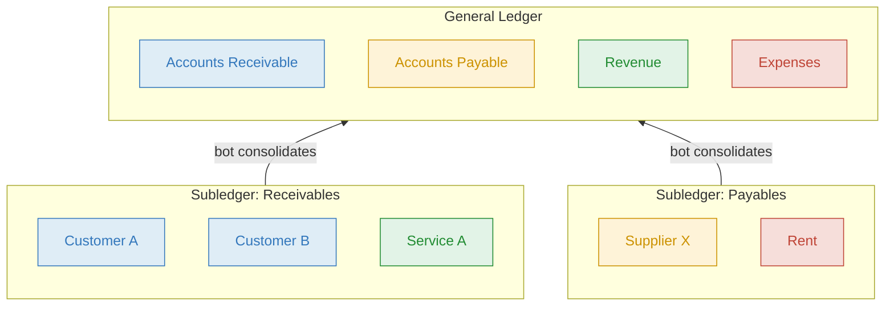
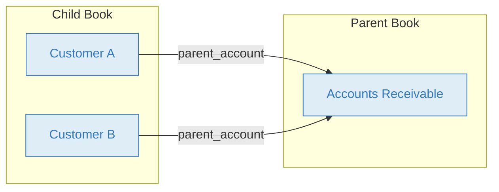
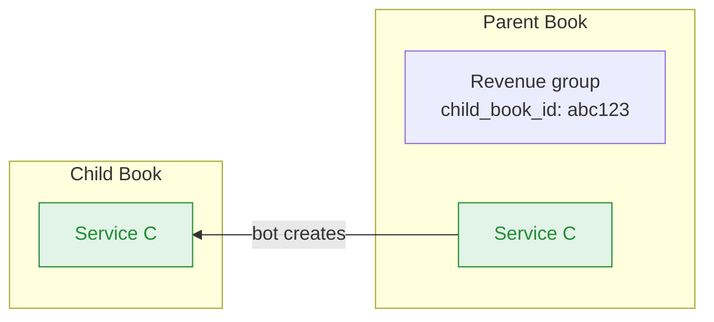

# Subledger Bot

The Subledger Bot connects books in a parent–child relationship, automatically consolidating transactions from subledger books into a general ledger. Each subledger operates independently — with its own accounts, permissions, and workflows — while the parent book provides a unified view.

This is useful for dividing work between teams (e.g. one team tracking receivables, another tracking payables) or consolidating subsidiary books into a single parent book.

## Why it works this way

In Bkper, every Book is a self-contained zero-sum ledger. The bot must preserve that invariant when consolidating.

- **Permanent accounts** (Asset and Liability) carry cumulative balances. In a subledger, many individual child accounts (like Customer A, Customer B) can map to a single consolidated parent account (like Accounts Receivable). This is many-to-one consolidation.
- **Non-permanent accounts** (Incoming and Outgoing) track period activity. Revenue and expense categories must exist on both books with the same meaning, so the bot syncs them one-to-one via `child_book_id`.

This is why the bot supports two different strategies: **many-to-one mapping** for permanent positions, and **one-to-one sync** for activity categories.

## How it works

The bot listens for events in child books. When a transaction is posted in a child book, the bot records a corresponding transaction in the parent book, mapping child accounts to parent accounts based on configured properties.



The bot also syncs accounts from parent to child — when you add an account to a synced group on the parent, the bot creates it on the child book automatically.

## Consolidating transactions

When you post a transaction on a child book, the bot maps child accounts to parent accounts and records the transaction on the parent.

**You post on the child book (Receivables):**

```
05/03  300.00  Service B  >>  Customer A  Invoice #1042
```

**The bot records on the parent book (General Ledger):**

```
05/03  300.00  Service B  >>  Accounts Receivable  Invoice #1042
```

The bot resolves each account in four steps:
1. Check the child account for a `parent_account` property
2. Check the child account's groups for a `parent_account` property
3. Check if the child account belongs to a group linked to the parent via `child_book_id`; if so, fall back to a parent account with the same name
4. Fall back to a parent account with the same name

In this example, *Customer A* is in a group with `parent_account: Accounts Receivable`, so it maps to the consolidated account. *Service B* exists on both books (synced via `child_book_id`), so it maps by name.



| # | Book | Amount | From | | To | Description |
|---|---|---|---|---|---|---|
| You | Child | **300.00** | Service B `Incoming` | >> | Customer A `Asset` | Invoice #1042 |
| Bot | Parent | **300.00** | Service B `Incoming` | >> | Accounts Receivable `Asset` | Invoice #1042 |

The bot copies all visible properties from the child transaction to the parent, preserves the original description, and adds `child_from` and `child_to` properties so you can trace the original child accounts. When the child transaction is later updated, attached URLs and files are also synced to the parent.

## Syncing accounts

For non-permanent accounts (revenue, expenses) that should exist on both parent and child books, set `child_book_id` on a group in the parent book. When you add an account to that group, the bot creates it on the child book.



This keeps shared account structures in sync without manual duplication. The bot also syncs account updates and deletions.

**What gets copied (parent → child):**
- Account or group name
- Account type
- Visible properties
- Archived state
- Group memberships (only for groups linked via `child_book_id`)

The `child_book_id` property itself is not copied to the child book.

**Deletion behavior:**
- If the synced account has posted transactions on the child book, it is removed.
- If it has no posted transactions, it is archived instead.

## Configuration

<details>
<summary><strong>Child book properties</strong></summary>

Set on the child book's book properties to establish the parent–child relationship.

| Property | Description |
|---|---|
| `parent_book_id` | The `bookId` of the parent book. Found in the book URL: `app.bkper.com/b/#transactions:bookId=<id>`. Also accepts the legacy key `parent_book` |

All books in the subledger structure (parent and children) must be part of the same [Collection](https://bkper.com/docs/guides/using-bkper/books) so the bot has permission to read and write across both books. The bot must be installed on all participating books.

```yaml
parent_book_id: agtzfmJrcGVyLWhyZBcLEgpHbHhBY291bnQY
```

</details>

<details>
<summary><strong>Account & Group properties (child book)</strong></summary>

Set on accounts or groups in the child book to define how they map to the parent.

| Property | Description |
|---|---|
| `parent_account` | Name of the account on the parent book that this child account (or group of accounts) maps to. When set on a group, all accounts in that group map to the same parent account |

**Example — map an entire receivables group to one parent account:**

```yaml
# Group: Accounts Receivable (child book)
parent_account: Accounts Receivable
```

All transactions involving Customer A, Customer B, etc. are recorded on the parent using `Accounts Receivable`. If the parent account doesn't exist yet, the bot creates it automatically.

> **Auto-creation only works when `parent_account` is set on a group.** When set directly on an individual child account, the bot looks up the parent account but does not create it — the parent transaction is saved as a draft if the account is missing.

> When `parent_account` is not set, the bot looks for a parent account with the same name as the child account. If neither account can be resolved on the parent, the transaction is created as a draft for manual resolution. Draft transactions are incomplete and do not affect balances; you can review them in the parent book, fix the missing account mapping, and post them manually.

> **Group events on the child book are also handled.** If a child group has the `parent_account` property, the bot treats group events as instructions to manage the corresponding parent account:
> - `GROUP_CREATED` on the child → creates the parent account
> - `GROUP_UPDATED` on the child → updates the parent account name and type
> - `GROUP_DELETED` on the child → deletes or archives the parent account

</details>

<details>
<summary><strong>Transaction properties</strong></summary>

Optional properties to control how individual transactions are consolidated.

| Property | Description |
|---|---|
| `parent_amount` | Amount to record on the parent book instead of the child transaction's amount. Set to `0` to skip consolidation entirely |

**Example — record a different amount on parent:**

```yaml
parent_amount: 250.00
```

The child transaction keeps its original amount, but the parent gets 250.00.

</details>

<details>
<summary><strong>Group properties (parent book)</strong></summary>

Set on groups in the parent book to enable account syncing from parent to child.

| Property | Description |
|---|---|
| `child_book_id` | The `bookId` of the child book to sync accounts to. When an account is added to this group on the parent, the bot creates it on the child book |

```yaml
# Group: Revenue (parent book)
child_book_id: agtzfmJrcGVyLWhyZBcLEgpHbHhBY291bnQY
```

> This requires the Subledger Bot to be installed on the parent book as well.

</details>

## Examples

<details>
<summary><strong>Permanent accounts — many-to-one consolidation</strong></summary>

The child book has individual customer accounts grouped under *Accounts Receivable* with `parent_account: Accounts Receivable`. The parent book has a single *Accounts Receivable* account.

| # | Book | Amount | From | | To |
|---|---|---|---|---|---|
| You | Child | **200.00** | Service A `Incoming` | >> | Customer A `Asset` |
| Bot | Parent | **200.00** | Service A `Incoming` | >> | Accounts Receivable `Asset` |
| You | Child | **300.00** | Service B `Incoming` | >> | Customer A `Asset` |
| Bot | Parent | **300.00** | Service B `Incoming` | >> | Accounts Receivable `Asset` |

**Result:** Child book shows 500.00 receivable from Customer A. Parent book shows 500.00 in Accounts Receivable — consolidated from all customers.

The parent transactions include `child_from` and `child_to` properties for traceability.

</details>

<details>
<summary><strong>Non-permanent accounts — shared account sync</strong></summary>

Revenue and expense accounts should exist on both books. Set `child_book_id` on the parent's Revenue group.

| # | Book | What happens |
|---|---|---|
| You | Parent | Add "Service C" to Revenue group |
| Bot | Child | Account "Service C" created automatically |

Now when a transaction is posted on the child using Service C, the bot records it on the parent using the same account name.

</details>

<details>
<summary><strong>Custom amounts with parent_amount</strong></summary>

When the parent should reflect a different amount (e.g. after tax deductions), set `parent_amount` on the child transaction.

| # | Book | Amount | From | | To | Note |
|---|---|---|---|---|---|---|
| You | Child | **1,100.00** | Revenue `Incoming` | >> | Client `Asset` | Full amount with tax |
| Bot | Parent | **1,000.00** | Revenue `Incoming` | >> | Accounts Receivable `Asset` | `parent_amount: 1000` |

Set `parent_amount: 0` to skip recording on the parent entirely.

</details>

<details>
<summary><strong>Events handled</strong></summary>

The bot responds to the following Bkper events:

| Event | Direction | Behavior |
|---|---|---|
| `TRANSACTION_POSTED` | Child → Parent | Creates parent transaction. Posts it if both accounts resolve; otherwise saves as draft. |
| `TRANSACTION_CHECKED` | Child → Parent | If parent transaction exists: checks it (posting first if needed). If missing: creates, posts, and checks it. |
| `TRANSACTION_UPDATED` | Child → Parent | **Only if parent transaction exists.** Unchecks it first, then updates amount, accounts, description, properties, URLs, and files. |
| `TRANSACTION_DELETED` | Child → Parent | Unchecks if needed, then trashes the parent transaction. |
| `TRANSACTION_RESTORED` | Child → Parent | Untrashes the parent transaction. |
| `ACCOUNT_CREATED` | Parent → Child | Creates account on child (via `child_book_id` group). |
| `ACCOUNT_UPDATED` | Parent → Child | Updates account on child. |
| `ACCOUNT_DELETED` | Parent → Child | Deletes or archives account on child (archives if no posted transactions). |
| `GROUP_CREATED` | Parent → Child | Creates group on child. |
| `GROUP_UPDATED` | Parent → Child | Updates group on child. |
| `GROUP_DELETED` | Parent → Child | Deletes group on child. |
| `GROUP_CREATED` | Child → Parent | If child group has `parent_account`, creates the corresponding parent account. |
| `GROUP_UPDATED` | Child → Parent | If child group has `parent_account`, updates the corresponding parent account. |
| `GROUP_DELETED` | Child → Parent | If child group has `parent_account`, deletes or archives the corresponding parent account. |

> Transactions originating from the Exchange Bot are automatically skipped to avoid duplication.

</details>

## Learn more

- [Structuring Books & Collections](https://bkper.com/docs/guides/accounting-principles/modeling/structuring-books-collections) — how bots connect books for consolidated reporting
- [Tracking departments & projects](https://bkper.com/docs/guides/accounting-principles/modeling/tracking-departments-projects) — approaches to segment-level bookkeeping
