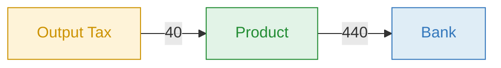
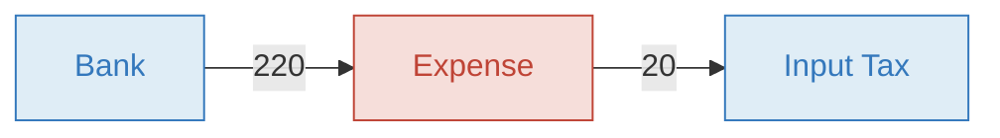
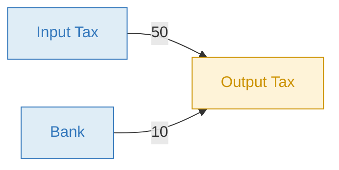

# Tax Bot

The Tax Bot automatically calculates and records tax entries — VAT, GST, income tax, or any rate-based tax — whenever a transaction is posted in your book. It supports two rate types with rates configured on accounts or groups.

Once triggered, the bot records one or more additional transactions representing the tax entries, giving you real-time visibility into tax receivables and payables without manual calculations.

## How it works

The Tax Bot listens for transaction events. When a transaction is posted, updated, restored, or deleted, it checks the properties of both accounts involved. If either account (or its group) has `tax_description` with `tax_included_rate` or `tax_excluded_rate`, the bot calculates the tax and records (or removes) the corresponding tax transactions.

**Supported events:**

| Event | Bot action |
|---|---|
| `TRANSACTION_POSTED` | Calculates and creates tax entries |
| `TRANSACTION_UPDATED` | Deletes old tax entries and recreates them if accounts, amount, date, or tax overrides changed |
| `TRANSACTION_RESTORED` | Recreates tax entries for the restored transaction |
| `TRANSACTION_DELETED` | Removes the linked tax entries |

**You post:**

```
01/07  440.00  Product  >>  Bank  Service sold
```

**The bot records** (assuming `tax_included_rate: 10` on the *Product* account):

```
01/07   40.00  Output Tax  >>  Product  #vatout Service sold
```

The tax (40.00) is extracted from the recorded amount, reducing revenue from 440 to 400 and creating a 40 tax liability.

## Included vs excluded rate

The difference between the two rate types is the **formula** used to calculate the tax:

| Rate type | Formula | Example |
|---|---|---|
| `tax_included_rate` | `amount × rate ÷ (100 + rate)` | `110 × 10 ÷ 110 = 10.00` |
| `tax_excluded_rate` | `netAmount × rate ÷ 100` | `100 × 10 ÷ 100 = 10.00` |

**Included rate** — the rate is a percentage of the **net** amount. Use when the price already contains tax (common with VAT-inclusive pricing). A 10% included rate on 110 gives 10 of tax and 100 net.

**Excluded rate** — the rate applies to the amount **remaining after included taxes are extracted** (`netAmount`). If no included taxes are present, `netAmount` equals the original recorded amount. A 10% excluded rate on 110 (with no included tax) gives 11 of tax.

## Tax on sales (included)

You sell a product for 440 (VAT included at 10%). The customer pays 440, of which 400 is revenue and 40 is the government's money passing through you.



| # | Amount | From | | To | Description |
|---|---|---|---|---|---|
| You | **440** | Product `Incoming` | >> | Bank `Asset` | Service sold |
| Bot | **40** | Output Tax `Liability` | >> | Product `Incoming` | #vatout Service sold |

**Result:** Revenue 400, Output Tax 40, Bank +440

Account properties on the **incoming** account (e.g. *Product*):

```yaml
tax_included_rate: 10
tax_description: Output Tax ${account.name} #vatout ${transaction.description}
```

## Tax on purchases (included)

You buy supplies for 220 (VAT included at 10%). You pay 220, of which 200 is your real expense and 20 is a tax credit you reclaim from the government.



| # | Amount | From | | To | Description |
|---|---|---|---|---|---|
| You | **220** | Bank `Asset` | >> | Expense `Outgoing` | Supplies purchased |
| Bot | **20** | Expense `Outgoing` | >> | Input Tax `Asset` | #vatin Supplies purchased |

**Result:** Expense 200, Input Tax 20, Bank −220

Account properties on the **outgoing** account (e.g. *Expense*):

```yaml
tax_included_rate: 10
tax_description: ${account.name} Input Tax #vatin ${transaction.description}
```

## Configuration

<details>
<summary><strong>Account & Group properties</strong></summary>

Set these on accounts or groups that should trigger the Tax Bot. When set on a group, all accounts in that group inherit the tax behavior.

| Property | Description |
|---|---|
| `tax_excluded_rate` | Tax rate applied to the net amount: `netAmount × rate ÷ 100` |
| `tax_included_rate` | Tax rate extracted using the net formula: `amount × rate ÷ (100 + rate)` |
| `tax_description` | Description for the generated tax transaction. Bkper parses the first words as the From account, the next words as the To account, and the remainder as the visible description. Supports [expressions](#expressions). **Required.** |

**Example — 10% included VAT on sales:**

```yaml
tax_included_rate: 10
tax_description: Output Tax ${account.name} #vatout ${transaction.description}
```

**Example — 10% excluded rate:**

```yaml
tax_excluded_rate: 10
tax_description: Output Tax ${account.name} #tax ${transaction.description}
```

> A single account can have both `tax_included_rate` and `tax_excluded_rate`, producing two separate tax transactions. To apply multiple distinct tax rates (e.g. state + federal), use [groups](#multiple-taxes-on-one-transaction).

</details>

<details>
<summary><strong>Transaction properties</strong></summary>

Optional properties to override or fine-tune tax calculations on individual transactions.

| Property | Description |
|---|---|
| `tax_round` | Number of decimal digits to round the tax amount. Maximum `8`. |
| `tax_included_amount` | Fixed tax amount to override the calculated included tax. Only applies when the account or group also has `tax_included_rate` (or legacy `tax_rate` > 0). |
| `tax_excluded_amount` | Fixed tax amount to override the calculated excluded tax. Only applies when the account or group also has `tax_excluded_rate` (or legacy `tax_rate` < 0). |

**Example — round tax to 1 decimal:**

```yaml
tax_round: 1
```

> When multiple accounts or groups trigger taxes on the same transaction, they all share the same single override value from the transaction properties.

</details>

> Generated tax transactions automatically copy most source transaction properties, with the exception of `tax_round`, `tax_included_amount`, `tax_excluded_amount`, and exchange-rate fields (`exc_rate`, `exc_amount`), which are excluded or transformed. No book-level property configuration is required.

## Expressions

<details>
<summary><strong>Dynamic variables for <code>tax_description</code></strong></summary>

Expressions reference values from the posting event that triggered the Tax Bot. Use them in `tax_description` to dynamically build the accounts and description on the generated tax transaction.

| Expression | Description |
|---|---|
| `${account.name}` | The account that triggered the Tax Bot |
| `${account.name.origin}` | The account name when it participates as the From Account (empty otherwise) |
| `${account.name.destination}` | The account name when it participates as the To Account (empty otherwise) |
| `${account.contra.name}` | The contra account of the account that triggered the Tax Bot |
| `${account.contra.name.origin}` | The contra account name as the From Account (empty otherwise) |
| `${account.contra.name.destination}` | The contra account name as the To Account (empty otherwise) |
| `${transaction.description}` | The description from the posted transaction |

**Example:**

```yaml
tax_description: Output Tax ${account.name} #vatout ${transaction.description}
```

For a transaction `440.00 Product >> Bank  Service sold` with `tax_included_rate: 10` on the *Product* account, the bot generates the description string:

```
Output Tax Product #vatout Service sold
```

Bkper parses this from left to right — `Output Tax` becomes the From account, `Product` becomes the To account, and `#vatout Service sold` is the visible description.

</details>

## Behavior details

<details>
<summary><strong>How the bot handles tax entries</strong></summary>

| Behavior | Details |
|---|---|
| **Tax amounts always positive** | Tax entries are recorded as positive amounts regardless of the original transaction direction. |
| **100% included tax limit** | If the sum of all included rates on the accounts/groups involved is ≥ 100%, the bot rejects the transaction with an error. |
| **Property copying** | Most source transaction properties are copied to tax transactions. `tax_round`, `tax_included_amount`, `tax_excluded_amount`, and exchange-rate props (`exc_rate`, `exc_amount`) are excluded or transformed. |
| **Exchange properties** | `exc_code` and `exc_date` are copied directly. `exc_rate` and `exc_amount` are recalculated for the tax amount. If the recalculated amount rounds to zero, the exchange rate is removed to avoid mirror exchange transactions. |
| **Remote ID tracking** | Each tax entry is linked to the source transaction via a remote ID (`{taxProperty}_{transaction.id}_{accountOrGroup.id}`), which the bot uses to find and delete entries later. |
| **Delete behavior** | When a source transaction is deleted or updated, tax entries are unchecked and moved to trash — not permanently deleted. |
| **Bot loop prevention** | The bot ignores transactions created by `sales-tax-bot` (itself) and `exchange-bot` to avoid recursive processing. |
| **Update optimization** | On `TRANSACTION_UPDATED`, the bot skips recalculation if only irrelevant fields changed (e.g., description without amount/account changes). |

</details>

## Advanced

<details>
<summary><strong>Multiple taxes on one transaction</strong></summary>

A single account can have both `tax_included_rate` and `tax_excluded_rate`, producing two separate tax transactions. To apply additional distinct tax rates (e.g. state + federal) to the same transaction, create separate **groups** — each with its own rate — and add the account to both groups.

For each posted transaction, the Tax Bot records a separate tax entry per group:

| # | Amount | From | | To | Description |
|---|---|---|---|---|---|
| You | **560** | Product `Incoming` | >> | Client A `Asset` | 5 items sold |
| Bot | **8.12** | Output Tax `Liability` | >> | Product `Incoming` | #federal #outputtax |
| Bot | **10.82** | Output Tax `Liability` | >> | Product `Incoming` | #state #outputtax |

</details>

<details>
<summary><strong>Closing a tax period</strong></summary>

At the end of a tax period, close the outstanding Input Tax and Output Tax balances. Offset the credits against the liability, then pay (or reclaim) the difference.

**Example:** Input Tax = 50, Output Tax = 60. You owe 10.



| # | Amount | From | | To |
|---|---|---|---|---|
| 1 | **50** | Input Tax `Asset` | >> | Output Tax `Liability` |
| 2 | **10** | Bank `Asset` | >> | Output Tax `Liability` |

After settlement, both Input Tax and Output Tax have zero balance.

</details>

## Learn more

- [Sales Taxes / VAT](https://bkper.com/docs/guides/accounting-principles/fundamentals/sales-taxes-vat) — conceptual guide on recording tax transactions in Bkper
