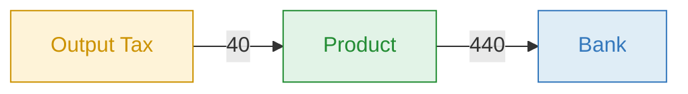
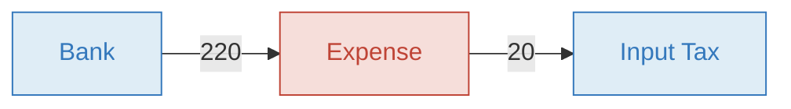
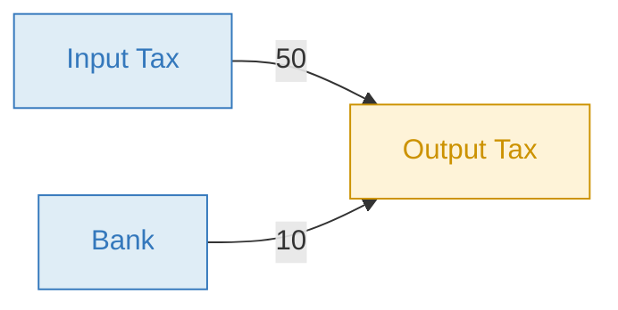

# Tax Bot

The Tax Bot automatically calculates and records tax entries — VAT, GST, income tax, or any rate-based tax — whenever a transaction is posted in your book. It supports two rate types with rates configured on accounts or groups.

Once triggered, the bot records one or more additional transactions representing the tax entries, giving you real-time visibility into tax receivables and payables without manual calculations.

## How it works

The Tax Bot listens for the `TRANSACTION_POSTED` event. When a transaction is posted, it checks the properties of both accounts involved. If either account (or its group) has `tax_description` with `tax_included_rate` or `tax_excluded_rate`, the bot calculates the tax and records a new transaction.

**You post:**

```
01/07  440.00  Product  >>  Bank  Service sold
```

**The bot records** (assuming `tax_included_rate: 10` on the *Product* account):

```
01/07   40.00  Output Tax  >>  Product  #vatout Service sold
```

The tax (40.00) is extracted from the recorded amount, reducing revenue from 440 to 400 and creating a 40 tax liability.

## Included vs excluded rate

Both rate types extract tax from the recorded amount. The difference is the **formula** used to calculate the tax:

| Rate type | Formula | Example: rate 10%, amount 110 |
|---|---|---|
| `tax_included_rate` | `amount × rate ÷ (100 + rate)` | `110 × 10 ÷ 110 = 10.00` |
| `tax_excluded_rate` | `amount × rate ÷ 100` | `110 × 10 ÷ 100 = 11.00` |

**Included rate** — the rate is a percentage of the **net** amount. Use when the price already contains tax (common with VAT-inclusive pricing). A 10% included rate on 110 gives 10 of tax and 100 net.

**Excluded rate** — the rate applies directly to the recorded amount. Use when the rate is defined as a percentage of the gross. A 10% excluded rate on 110 gives 11 of tax.

## Tax on sales (included)

You sell a product for 440 (VAT included at 10%). The customer pays 440, of which 400 is revenue and 40 is the government's money passing through you.



| # | Amount | From | | To | Description |
|---|---|---|---|---|---|
| You | **440** | Product `Incoming` | >> | Bank `Asset` | Service sold |
| Bot | **40** | Output Tax `Liability` | >> | Product `Incoming` | #vatout Service sold |

**Result:** Revenue 400, Output Tax 40, Bank +440

Account properties on the **incoming** account (e.g. *Product*):

```yaml
tax_included_rate: 10
tax_description: Output Tax ${account.name} #vatout ${transaction.description}
```

## Tax on purchases (included)

You buy supplies for 220 (VAT included at 10%). You pay 220, of which 200 is your real expense and 20 is a tax credit you reclaim from the government.



| # | Amount | From | | To | Description |
|---|---|---|---|---|---|
| You | **220** | Bank `Asset` | >> | Expense `Outgoing` | Supplies purchased |
| Bot | **20** | Expense `Outgoing` | >> | Input Tax `Asset` | #vatin Supplies purchased |

**Result:** Expense 200, Input Tax 20, Bank −220

Account properties on the **outgoing** account (e.g. *Expense*):

```yaml
tax_included_rate: 10
tax_description: ${account.name} Input Tax #vatin ${transaction.description}
```

## Configuration

<details>
<summary><strong>Account & Group properties</strong></summary>

Set these on accounts or groups that should trigger the Tax Bot. When set on a group, all accounts in that group inherit the tax behavior.

| Property | Description |
|---|---|
| `tax_excluded_rate` | Tax rate applied directly to the recorded amount: `amount × rate ÷ 100` |
| `tax_included_rate` | Tax rate extracted using the net formula: `amount × rate ÷ (100 + rate)` |
| `tax_description` | Description for the generated tax transaction. Supports [expressions](#expressions) to dynamically reference accounts and descriptions |

**Example — 10% included VAT on sales:**

```yaml
tax_included_rate: 10
tax_description: Output Tax ${account.name} #vatout ${transaction.description}
```

**Example — 10% excluded rate:**

```yaml
tax_excluded_rate: 10
tax_description: Output Tax ${account.name} #tax ${transaction.description}
```

> You cannot set both `tax_included_rate` and `tax_excluded_rate` on the same account. To apply multiple tax rates, use [groups](#multiple-taxes-on-one-transaction).

</details>

<details>
<summary><strong>Transaction properties</strong></summary>

Optional properties to override or fine-tune tax calculations on individual transactions.

| Property | Description |
|---|---|
| `tax_round` | Number of decimal digits to round the tax amount. Must be lower than the book's decimal digits setting |
| `tax_included_amount` | Fixed tax amount to override the calculated included tax |
| `tax_excluded_amount` | Fixed tax amount to override the calculated excluded tax |

**Example — round tax to 1 decimal:**

```yaml
tax_round: 1
```

</details>

> Generated tax transactions automatically copy eligible source transaction properties. No book-level property configuration is required.

## Expressions

<details>
<summary><strong>Dynamic variables for <code>tax_description</code></strong></summary>

Expressions reference values from the posting event that triggered the Tax Bot. Use them in `tax_description` to dynamically build the accounts and description on the generated tax transaction.

| Expression | Description |
|---|---|
| `${account.name}` | The account that triggered the Tax Bot |
| `${account.name.origin}` | The account name when it participates as the From Account (empty otherwise) |
| `${account.name.destination}` | The account name when it participates as the To Account (empty otherwise) |
| `${account.contra.name}` | The contra account of the account that triggered the Tax Bot |
| `${account.contra.name.origin}` | The contra account name as the From Account (empty otherwise) |
| `${account.contra.name.destination}` | The contra account name as the To Account (empty otherwise) |
| `${transaction.description}` | The description from the posted transaction |

**Example:**

```yaml
tax_description: Output Tax ${account.name} #vatout ${transaction.description}
```

For a transaction `440.00 Product >> Bank  Service sold` with `tax_included_rate: 10` on the *Product* account, the bot generates:

```
40.00 Output Tax >> Product #vatout Service sold
```

Here `${account.name}` resolved to `Product` and `${transaction.description}` resolved to `Service sold`. Bkper parses the result to find the accounts — `Output Tax` as the From account and `Product` as the To account.

</details>

## Advanced

<details>
<summary><strong>Multiple taxes on one transaction</strong></summary>

A single account can only have one `tax_included_rate` or `tax_excluded_rate`. To apply multiple tax rates (e.g. state + federal) to the same transaction, create separate **groups** — each with its own rate — and add the relevant accounts to both groups.


For each posted transaction, the Tax Bot records a separate tax entry for each group:


</details>

<details>
<summary><strong>Closing a tax period</strong></summary>

At the end of a tax period, close the outstanding Input Tax and Output Tax balances. Offset the credits against the liability, then pay (or reclaim) the difference.

**Example:** Input Tax = 50, Output Tax = 60. You owe 10.



| # | Amount | From | | To |
|---|---|---|---|---|
| 1 | **50** | Input Tax `Asset` | >> | Output Tax `Liability` |
| 2 | **10** | Bank `Asset` | >> | Output Tax `Liability` |

After settlement, both Input Tax and Output Tax have zero balance.

</details>

<details>
<summary><strong>Status icons</strong></summary>

| Icon | Meaning |
|---|---|
| Blue | Working properly |
| Red | Error occurred |
| Absent | Not installed on this book |

</details>

## Learn more

- [Sales Taxes / VAT](https://bkper.com/docs/guides/accounting-principles/fundamentals/sales-taxes-vat) — conceptual guide on recording tax transactions in Bkper
